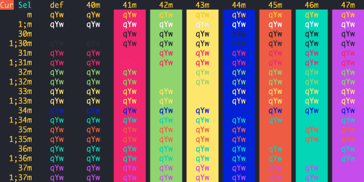
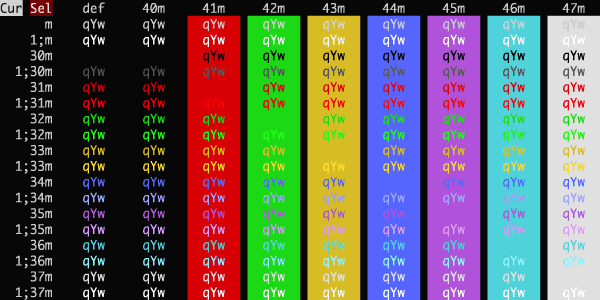
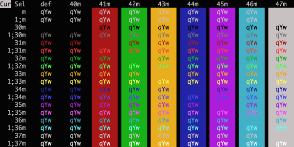
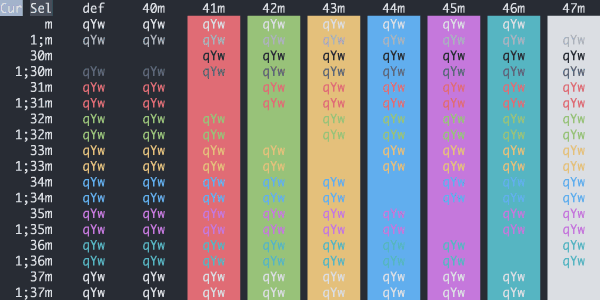
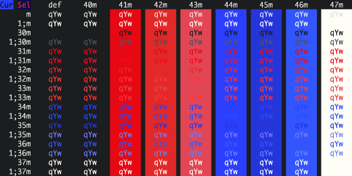
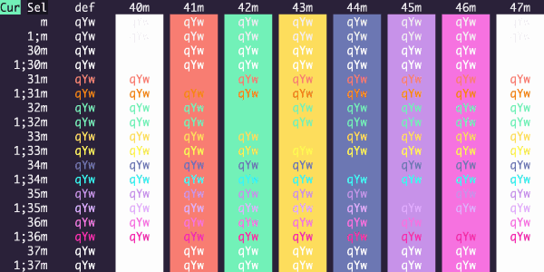

# iTerm Color Schemes

- [Intro](#intro)
- [Installation Instructions](#installation-instructions)
- [Contribute](#contribute)
- [Screenshots](#screenshots)
- [Credits](#credits)
- [Extra](#extra)
  - [X11 Installation](#x11-installation)
  - [Konsole color schemes](#konsole-color-schemes)
  - [Terminator color schemes](#terminator-color-schemes)
  - [Mac OS Terminal color schemes](#terminal-color-schemes)
  - [PuTTY color schemes](#putty-color-schemes)
  - [Xfce Terminal color schemes](#xfce-terminal-color-schemes)
  - [FreeBSD vt(4) color schemes](#freebsd-vt-color-schemes)
  - [Previewing color schemes](#previewing-color-schemes)
  - [MobaXterm color schemes](#mobaxterm-color-schemes)
  - [LXTerminal color schemes](#lxterminal-color-schemes)
  - [Visual Studio Code color schemes](#visual-studio-code-color-schemes)
  - [Windows Terminal color schemes](#windows-terminal-color-schemes)
  - [Alacritty color schemes](#alacritty-color-schemes)

## Intro

This is a set of color schemes for iTerm (aka iTerm2). It also includes ports to Terminal, Konsole, PuTTY, Xresources, XRDB, Remmina, Termite, XFCE, Tilda, FreeBSD VT, Terminator, Kitty, MobaXterm, LXTerminal, Microsoft's Windows Terminal, Visual Studio, Alacritty

Screenshots below and in the [screenshots](screenshots/) directory.

## Installation Instructions

There are 3 ways to install an iTerm theme:

- Direct way via keyboard shortcut:

  - Launch iTerm 2. Get the latest version at <a href="http://www.iterm2.com">iterm2.com</a>
  - Type CMD+i (⌘+i)
  - Navigate to **Colors** tab
  - Click on **Color Presets**
  - Click on **Import**
  - Click on the **schemes** folder
  - Select the **.itermcolors** profiles you would like to import
  - Click on **Color Presets** and choose a color scheme

- Via iTerm preferences (go to the same configuration location as above):

  - Launch iTerm 2. Get the latest version at <a href="http://www.iterm2.com">iterm2.com</a>
  - Click on **iTerm2** menu title
  - Select **Preferences...** option
  - Select **Profiles**
  - Navigate to **Colors** tab
  - Click on **Color Presets**
  - Click on **Import**
  - Select the .itermcolors file(s) of the [schemes](schemes/) you'd like to use \* Click on **Color Presets** and choose a color scheme

- Via Bash script

  - Launch iTerm 2. Get the latest version at <a href="http://www.iterm2.com">iterm2.com</a>
  - Run the following command:

  ```sh
  # Import all color schemes
  tools/import-scheme.sh schemes/*

  # Import all color schemes (verbose mode)
  tools/import-scheme.sh -v schemes/*

  # Import specific color schemes (quotations are needed for schemes with spaces in name)
  tools/import-scheme.sh 'schemes/SpaceGray Eighties.itermcolors' # by file path
  tools/import-scheme.sh 'SpaceGray Eighties'                     # by scheme name
  tools/import-scheme.sh Molokai 'SpaceGray Eighties'             # import multiple
  ```

  - Restart iTerm 2. (Need to quit iTerm 2 to reload the configuration file.)

## Contribute

Have a great iTerm theme? Send it to me via a Pull Request! To export your theme settings:

- Launch iTerm 2
- Type CMD+i (⌘+i)
- Navigate to **Colors** tab
- Click on **Color Presets**
- Click on **Export**
- Save the .itermcolors file

To include a screenshot, please generate the output using the [screenshotTable.sh script](tools/screenshotTable.sh) in the `tools` directory.

**For screenshot consistency, please have your font set to 13pt Monaco and no transparency on the window**

It would also be very helpful if you `cd tools/` and run `python3 update_all.py` to generate all formats of your scheme

## Screenshots

### 3024 Day


### 3024 Night


### Abernathy


### Adventure


### AdventureTime


### Afterglow


### AlienBlood


### Andromeda


### Argonaut


### Arthur


### AtelierSulphurpool


### Atom


### Atom One Light


### ayu


### ayu Light


### ayu Mirage


### Aurora



### Banana Blueberry


### Batman


### Belafonte Day


### Belafonte Night


### BirdsOfParadise


### Blazer


### BlueBerry Pie


### BlueDolphin


### Blue Matrix


### Bluloco Dark


### Bluloco Light


### Borland


### Breeze


### Bright Lights


### Broadcast


### Brogrammer


### Builtin Dark


### Builtin Light


### Builtin Pastel Dark


### Builtin Solarized Dark


### Builtin Solarized Light


### Builtin Tango Dark


### Builtin Tango Light


### C64


### Calamity


### Chalk


### Chalkboard


### ChallengerDeep


### Chester


### Ciapre


### CLRS


### Cobalt Neon


### Cobalt2


### Coffee


### CrayonPonyFish


### Cyberdyne


### Cyberpunk


### Dark Pastel


## Dark+


### Darkside


### Deep



### Desert


### DimmedMonokai


### Django


### DjangoRebornAgain


### DjangoSmoothy


### Doom One


### Doom Peacock


### DotGov


### Dracula


### Dracula+


### Duotone Dark


### Earthsong


### Elemental


### Elementary


### ENCOM


### Espresso


### Espresso Libre


### Fairyfloss


### Fahrenheit


### Fideloper


### FirefoxDev


### Firewatch


### FishTank


### Flat


### Flatland


### Floraverse


### Forest Blue


### Framer


### FrontEndDelight


### FunForrest


### Galaxy


### Galizur 


### Github


### GitHub Dark


### Glacier


### Grape


### Grass


### Gruvbox Dark


### Gruvbox Light


### Guezwhoz


### Hacktober


### Hardcore


### Harper


### HaX0R_R3D


### HaX0R_GR33N


### HaX0R_BLUE


### Highway


### Hipster Green


### Hivacruz


### Homebrew


### Hopscotch


### Hopscotch 256


### Hurtado


### Hybrid


### IC\_Green\_PPL


### IC\_Orange\_PPL


### iceberg


### IDEA Drak


### idleToes


### IR_Black


### Jackie Brown


### Japanesque


### Jellybeans


### JetBrains Darcula


### Jubi


### Kibble


### Kolorit


### Konsolas



### Lab Fox


### Laser


### Later This Evening


### Lavandula


### LiquidCarbon


### LiquidCarbonTransparent


### LiquidCarbonTransparentInverse


### LoveLace


### Man Page


### Mariana


### Material


### MaterialDark


### MaterialDarker


### MaterialOcean


### Mathias


### Medallion


### Midnight In Mojave


### Mirage


### Misterioso


### Molokai


### MonaLisa


### Monokai Remastered


### Monokai Soda


### Monokai Vivid


### N0tch2k


### Neopolitan


### Neutron


### NightLion v1


### NightLion v2


### Night Owlish Light


### Novel


### Nocturnal Winter


### Nord


### Obsidian


### Ocean


### OceanicMaterial


### Ollie


### One Half Dark



### One Half Light


### Operator Mono Dark


### Overnight Slumber


### Palenight High Contrast


### Pandora


### Paraiso Dark


### PaulMillr


### Pencil Dark


### Pencil Light


### Peppermint


### Piatto Light


### Pnevma


### Popping and Locking


### Primary


### Pro


### Pro Light


### Purple Peter


### Purple Rain


### Rapture


### Raycast Dark


### Raycast Light


### Rebecca


### Red Alert


### Red Planet


### Red Sands


### Relaxed


### Rippedcasts


### Rouge 2


### Royal


### Ryuuko


### Sakura


### Scarlet Protocol


### Seafoam Pastel


### SeaShells


### Seti


### Shaman


### Shades-Of-Purple


### Slate


### SleepyHollow


### Smyck


### Snazzy


### SoftServer


### Solarized Darcula (With background image)


### Solarized Darcula (Without background image)


### Solarized Dark - Patched

Some applications assume the ANSI color code 8 is a gray color. Solarized treats
this code as equal to the background. This theme is for people who prefer the
former. See issues [#59][issue-59], [#62][issue-62], and [#63][issue-63] for
more information.


[issue-59]: https://github.com/mbadolato/iTerm2-Color-Schemes/issues/59
[issue-62]: https://github.com/mbadolato/iTerm2-Color-Schemes/issues/62
[issue-63]: https://github.com/mbadolato/iTerm2-Color-Schemes/pull/63

### Solarized Dark Higher Contrast


### SpaceGray


### SpaceGray Eighties


### SpaceGray Eighties Dull


### Spacedust


### Spiderman



### Spring


### Square


### Sublette


### Subliminal


### Sundried


### Symfonic


### synthwave


### Synthwave Everything



### Tango Adapted


### Tango Half Adapted


### Teerb


### Terminal Basic


### Thayer Bright


### The Hulk


### Tinacious Design (Dark)


### Tinacious Design (Light)


### Tomorrow


### Tomorrow Night


### Tomorrow Night Blue


### Tomorrow Night Bright


### Tomorrow Night Eighties


### Tomorrow Night Burns


### ToyChest


### Treehouse


### Twilight


### Ubuntu


### UltraViolent


### UltraDark


### Under The Sea


### Unikitty


### Urple


### Vaughn


### VibrantInk


### Violet Light


### Violet Dark


### WarmNeon


### Wez


### Whimsy


### WildCherry


### Wombat


### Wryan


### Zenburn


## Credits

The schemes Novel, Espresso, Grass, Homebrew, Ocean, Pro, Man Page, Red Sands, and Terminal Basic are ports of the schemes of the same name included with the Mac Terminal application. All of Terminal's schemes have now been ported, with the exception of "Solid Colors" (random backgrounds, which iTerm doesn't support) and "Aerogel" (which is hideous).

The scheme Violet was created by [ashfinal](https://github.com/ashfinal/vim-colors-violet).

The scheme idleToes was inspired by the [idleFingers](http://www.idlefingers.co.uk/) TextMate theme and suggested for inclusion by Seth Wilson.

The scheme Zenburn was inspired by the [Zenburn](http://sunaku.github.io/zenburn-terminal-color-scheme.html) version created by Suraj N. Kurapati.

The scheme Symfonic was inspired by the color scheme used in the [documentation](http://symfony.com/doc/current/book/index.html) for the [Symfony](http://www.symfony.com) PHP Framework.

The synthwave theme was created by [brettstil](https://github.com/brettstil/)

The scheme Github was inspired by the color theme palette used at [Github](https://github.com/) for their UI and in some of their mascot images.

The scheme Solarized Darcula was inspired by the color theme created by [@rickhanlonii](https://github.com/rickhanlonii). There are two screenshots below; one with a background and one without. The background image is included in the backgrounds/ directory and the image must be manually set on the profile's Preferences->Window tab. It's hard to see from the screenshot, but it looks great!

The theme Hurtado was found [here](https://github.com/juanghurtado/dotfiles).

The theme Molokai was based on the [vim colorscheme](https://github.com/tomasr/molokai) of the same name.

The theme Monokai Soda was found [here](https://github.com/deepsweet/Monokai-Soda-iTerm).

The theme Monokai Vivid was created by [vitalymak](https://github.com/vitalymak/iTerm2-Color-Schemes).

The theme Neopolitan was created by [daytonn](https://github.com/daytonn/iTerm2-Color-Schemes)

The theme Subliminal was created by [gdsrosa](https://github.com/gdsrosa/subliminal-itermcolors)

The themes Solarized Dark and Solarized Light come from the official [Solarized web site](http://ethanschoonover.com/solarized)

The Obsidian theme was on my hard drive and I don't recall where it came from. If anyone knows, ping me and I'll link back to the author(s).

The Spacedust theme was created by [mhallendal](https://github.com/mhallendal/spacedust-theme) and ported to iTerm by [Couto](https://github.com/Couto)

The theme Mathias was created by [mathiasbynens](https://github.com/mathiasbynens/dotfiles)

The LiquidCarbon themes were created by [markcho](https://github.com/markcho/iTerm2_LiquidCarbon)

The NightLion themes were created by [Curvve Media](http://www.curvve.com/blog/category/themes/)

The Tomorrow themes were created by [chriskempson](https://github.com/chriskempson/tomorrow-theme/tree/master/iTerm2)

The Tomorrow Night Burns theme were created by [ashwinv11](https://github.com/ashwinv11/)

The Twilight theme was created by [stefri](https://gist.github.com/stefri/1183140)

The Teerb theme was created by [Teerb](https://gist.github.com/teerb/1360453)

The IR_Black theme was found [here](https://gist.github.com/meqif/1238378)

The Misterioso theme was created by [flooose](https://github.com/flooose/misterioso-iterm2)

The Hybrid theme was found [here](https://gist.github.com/luan/6362811)

The Thayer Bright theme was found [here](https://github.com/t3chnoboy/thayer-bright-iTerm)

The Shades Of Purple theme was found [here](https://github.com/ahmadawais/shades-of-purple-iterm2) and ported by [fr3fou](https://github.com/fr3fou)

The Spring theme was found [here](https://github.com/t3chnoboy/spring-iTerm)

The Smyck theme was found [here](https://github.com/hukl/Smyck-Color-Scheme)

The Forest Blue theme was found [here](https://github.com/olkinn/forest-blue-iTerm)

The Cobalt2 theme was created by [wesbos](https://github.com/wesbos/Cobalt2-iterm)

The Operator Mono Dark was ported from [vharadkou](https://github.com/vharadkou/OperatorMonoDarkTheme) by [dreamyguy](https://github.com/dreamyguy/iterm-theme-operator-mono-dark)

The WarmNeon theme was ported from [PyCharm](http://www.jetbrains.com/pycharm/) by [firewut](https://github.com/firewut)

The SpaceGray theme was created by [ryentzer](https://github.com/ryentzer/SpaceGray-iTerm)

The Jellybeans theme was created by [qtpi](https://github.com/qtpi/Jellybeans.itermcolors)

The PaulMillr theme was created by [paulmillr](https://github.com/paulmillr/dotfiles/tree/master/terminal) and ported to iTerm by me

The Harper theme was created by [idleberg](https://github.com/idleberg/Harper-iTerm2)

The CLRS theme was created by [jasonlong](https://github.com/jasonlong/iterm-clrs)

The Dracula theme was created by [zenorocha](https://github.com/zenorocha/dracula-theme)

The Adventure theme was created by [hongzimao](https://github.com/hongzimao/iTerm2-Color-Schemes)

The themes AdventureTime, AlienBlood, BirdsOfParadise, Ciapre, CrayonPonyFish, DimmedMonokai, Earthsong, Elemental, FishTank, FrontEndDelight, FunForrest, Grape, Highway, IC_Green_PPL, IC_Orange_PPL, Lavandula, Medallion, MonaLisa, Ollie, Royal, SeaShells, Shaman, SleepyHollow, SoftServer, Sundried, ToyChest, Treehouse, and Urple were created by [zdj](https://github.com/zdj/themes/tree/master/iterm2)

The Japanesque theme was created by [aereal](https://github.com/aereal/dotfiles/blob/master/colors/Japanesque/Japanesque.itermcolors)

The Seti theme was created by [jesseweed](https://github.com/jesseweed/seti-syntax/) and ported to iTerm2 by [philduffy](https://github.com/willmanduffy/seti-iterm) and slightly modified to make the ANSI blacks have a little more contrast

The Hipster Green and Jackie Brown themes were created by [Unkulunkulu](https://github.com/Unkulunkulu)

The Aurora theme was created by [fcsmJS](https://github.com/fcsmJS/iTerm2-Color-Schemes)

The Chalk theme was created by [achalv](https://github.com/achalv/chalk)

The Pencil Dark and Pencil Light themes were created by [mattly](https://github.com/mattly/iterm-colors-pencil)

The Flat theme was created by [ahmetsulek](https://github.com/ahmetsulek/flat-terminal)

The Atom, Brogrammer, Glacier and Darkside themes were created by [bahlo](https://github.com/bahlo/iterm-colors)

The Afterglow theme was created by [yabatadesign](https://github.com/YabataDesign/afterglow-itermcolors)

The Broadcast theme was created by [vinkla](https://github.com/vinkla/broadcast-theme)

The Arthur, N0tch2k, Pnevma, Square, and Wryan themes were created by [baskerville](https://github.com/baskerville/iTerm-2-Color-Themes)

The Belafonte Day, Belafonte Night, Paraiso Dark, and C64 themes were created by [idleberg](https://github.com/idleberg)

The 3024 Day and 3024 Night themes were created by [0x3024](https://github.com/0x3024)

The Argonaut theme was created by [effkay](https://github.com/effkay/iTerm-argonaut)

The Espresso Libre theme was created by [jurgemaister](https://github.com/jurgemaister/Espresso-Libre)

The Hardcore theme was created by [hardcore](https://github.com/hardcore/iTerm-colors)

The Rippedcasts theme was created by [mdw123](https://github.com/mdw123/rippedcasts)

The Solorized Dark Higher Contrast theme was created by [heisters](https://gist.github.com/heisters/1015503)

The VibrantInk theme was created by [asanghi](https://github.com/asanghi/vibrantinklion)

The Wez theme was created by [wez](https://gist.github.com/wez/850268/)

The Wombat theme was created by [djoyner](https://github.com/djoyner/iTerm2-wombat)

The WildCherry theme was created by [mashaal](https://github.com/mashaal/wild-cherry)

The Flatland theme was created by [realchaseadams](http://www.snip2code.com/Snippet/148193/Flatland-color-scheme-for-iTerm2)

The Neutron theme was created by [Ch4s3](https://github.com/Ch4s3/iTerm2-Neutron)

The Fideloper theme was inspired by [Fideloper](http://fideloper.com/)

The Later This Evening theme was created by [vilhalmer](https://github.com/vilhalmer/System/tree/master/terminal-themes)

The Galaxy theme was created by [jglovier](https://github.com/jglovier/galaxy-theme-iterm)

The Slate theme was created by [deneshshan](https://github.com/deneshshan)

The SpaceGray Eighties and SpaceGray Eighties Dull themes were created by [mhkeller](https://github.com/mhkeller/spacegray-eighties-iterm)

The Borland theme was created by [delip](https://gist.github.com/delip/9e16c606d9331d69d681)

The Cobalt Neon theme was created by [vazquez](https://github.com/vazquez/cobalt-neon-iterm)

The AtelierSulphurpool theme was created by [atelierbram](http://atelierbram.github.io/syntax-highlighting/atelier-schemes/sulphurpool/)

The Batman, Spiderman, and The Hulk themes were created by [pyrophos](https://github.com/pyrophos)

The ENCOM theme was created by [Josh Braun](http://wideaperture.net)

The Floraverse theme was created by [papayakitty](http://floraverse.com/)

The Material and MaterialDark themes were created by [stoeffel](https://github.com/stoeffel/material-iterm)

The OceanicMaterial theme was created by [rahulpatel](https://github.com/rahulpatel)

The MaterialOcean theme was found [here](https://github.com/kaicataldo/material.vim/blob/master/terminal-colors/iterm2/material-ocean.itermcolors) and was ported by [fr3fou](https://github.com/fr3fou)

The AtomOneLight theme was created by [iamstarkov](https://github.com/iamstarkov)

The Piatto Light theme was created by [kovv](https://github.com/kovv)

The DotGov theme was inspired by the color palette used in the [U.S. Web Design Standards](https://standards.usa.gov/visual-style/)

The DuoTone Dark theme was created by [chibicode](http://chibicode.com) based on [simurai](https://github.com/simurai)'s [duotone-dark](https://github.com/simurai/duotone-dark-syntax) Atom theme.

The JetBrains Darcula theme was created by [vitstr](https://github.com/vitstr)

The Bright Lights theme was created by [tw15egan](https://github.com/tw15egan)

The Ubuntu theme was inspired by default Ubuntu's console colors. Created by [Maximus](http://superuser.com/questions/497240/ubuntu-purple-terminal-colors-in-conemu) and ported to iTerm2 by [stepin](https://github.com/stepin).

The Under The Sea theme was created by [peterpme](https://github.com/peterpme)

The One Half themes were created by [sonph](https://github.com/sonph), based on Atom's One with some tweakings.

The FirefoxDev theme was created by [Or3stis](https://github.com/Or3stis)

The Ryuuko theme was created by [dylanaraps](https://github.com/dylanaraps) and added by [iandrewt](https://github.com/iandrewt)

The Firewatch theme was created by [Sebastian Szturo](https://github.com/SebastianSzturo) as an [atom syntax theme](https://atom.io/themes/firewatch-syntax) and ported to an iTerm scheme by [Ben Styles](https://github.com/leeds-ebooks). It was originally inspired by the [Firewatch game](http://www.firewatchgame.com/).

The Pandora theme was created by [milosmatic](https://github.com/milosmatic/Pandora-iterm)

The Elementary OS theme was created by [elementary.io](https://elementary.io/) and added by [987poiuytrewq](https://github.com/987poiuytrewq)

The Gruvbox Dark theme was created by [morhetz](https://github.com/morhetz) and added by [mcchrish](https://github.com/mcchrish)

The Ayu and Ayu Light themes were created by [alebcay](https://github.com/alebcay)

The Deep theme was created by [ADoyle](https://github.com/adoyle-h)

The Red Planet theme was created by [ibrokemypie](https://github.com/ibrokemypie) based on [eliquious](https://github.com/eliquious)'s [Red Planet](https://github.com/eliquious/Red-Planet-Theme) Sublime Text theme.

The Tango Adapted theme and its slightly less bright counterpart Tango Half Adapted were created by [crowsonkb](https://github.com/crowsonkb), based on iTerm2's Tango Light theme.

The Pro Light theme was adapted from the Pro theme by [crowsonkb](https://github.com/crowsonkb) using her [iterm_schemer](https://github.com/crowsonkb/iterm_schemer) tool.

The Fahrenheit theme was created by [jonascarpay](https://github.com/jonascarpay) based on [fcpg](https://github.com/fcpg)'s [vim-fahrenheit](https://github.com/fcpg/vim-fahrenheit) Vim theme.

The Calamity and Rapture themes were created by [Pustur](https://github.com/Pustur)

The Purple Peter theme was created by [DeChamp](https://github.com/dechamp)

The Purple Rain theme was created by [msorre2](https://github.com/msorre2)

The ChallengerDeep theme was found [here](https://github.com/challenger-deep-theme/vim) and ported to iTerm by [eendroroy](https://github.com/eendroroy)

The Hopscotch theme was created by [Jan T. Sott](https://github.com/idleberg/Hopscotch)

The Hivacruz theme was created by [Yann Defretin](https://github.com/kinoute/hivacruz-itermcolors)

The Nocturnal Winter theme was created by [Shriram Balaji](https://github.com/Shriram-Balaji)

The Rebecca theme was created [vic](https://github.com/vic) based on his [emacs rebecca-theme](https://github.com/vic/rebecca-theme)

The Whimsy theme was created by [Rod](https://github.com/rod)

The Chester theme was created by [KH](https://github.com/spectralkh)

The Django theme was created by [Jannis Leidel](https://code.djangoproject.com/wiki/TextMate). The original colors schemes were created by [threespot.com](https://threespot.com) for the Django Software Foundation

The DjangoSmoothy theme was created by [Jannis Leidel](https://code.djangoproject.com/wiki/TextMate). The original colors schemes were created by [threespot.com](https://threespot.com) for the Django Software Foundation

The DjangoRebornAgain theme was created by [christopherscott](https://github.com/christopherscott/django-reborn) based on the original Django themes by [Jannis Leidel](https://code.djangoproject.com/wiki/TextMate)

The Kolorit theme was created by [thomaspaulmann](https://github.com/thomaspaulmann)

The Cyberpunk theme was created by [Murderlon](https://github.com/Murderlon/cyberpunk-iterm)

The LoveLace theme was created by [nalanbar](https://github.com/nalanbar) based on a dotfile from [elenapan](https://github.com/elenapan)

The Framer theme was created by [markogresak](https://github.com/markogresak) based on [Framer Syntax Theme](https://www.producthunt.com/posts/framer-syntax-theme) provided by [Framer](https://framer.com).

The Lab Fox theme was created by [theatlasroom](https://github.com/theatlasroom) inspired by the [Gitlab design system](https://design.gitlab.com)

The Unikitty theme was created by [jakebathman](https://github.com/jakebathman)

The Primary theme was created by [jayanthkoushik](https://github.com/jayanthkoushik) based on [Google's vim colorscheme](https://github.com/google/vim-colorscheme-primary).

The Andromeda theme was created by [memije](https://github.com/memije) based on [EliverLara](https://github.com/EliverLara/)'s [Andromeda](https://marketplace.visualstudio.com/items?itemName=EliverLara.andromeda) VS Code theme.

The Night Owlish Light theme was created by [praveenpuglia](https://github.com/praveenpuglia) based on [sdras](https://github.com/sdras)'s [Night Owl](https://github.com/sdras/night-owl-vscode-theme) VS Code theme.

The Midnight In Mojave theme was created by [OberstKrueger](https://github.com/oberstkrueger) based on the colors outlined in the [Human Interface Guidelines](https://developer.apple.com/design/human-interface-guidelines/macos/overview/themes/)

The Breeze theme was based on [the Breeze color scheme](https://github.com/KDE/konsole/blob/master/data/color-schemes/Breeze.colorscheme) by [KDE](https://kde.org) and ported to iTerm by [nieltg](https://github.com/nieltg)

The coffee theme was created by [cbitterfield](https://github.com/cbitterfield)

The Doom One theme was based on [Emacs Doom default theme](https://github.com/hlissner/emacs-doom-themes)

The Doom Peacock theme was based on [Emacs Doom Peacock theme](https://github.com/hlissner/emacs-doom-themes)

The Blueberry Banana, Blue Matrix, Cyberdyne, Laser, and Scarlet Protocol themes were created by [ReagentX](https://github.com/ReagentX)

The BlueBerry Pie theme was created together by [murmurlilia](https://www.instagram.com/the.julias/) and [fitz123](https://github.com/fitz123)

The Synthwave Everything theme was created by [smithbm2316](https://github.com/smithbm2316) based on [robb0wen's](https://github.com/robb0wen/) VS Code theme [Synthwave '84](https://github.com/robb0wen/synthwave-vscode)

The theme Sakura was created by [0xN0ri](https://github.com/0xN0ri) based on [zdj](https://github.com/zdj) iTerm 2 color scheme [Urple](https://github.com/mbadolato/iTerm2-Color-Schemes/blob/master/schemes/Urple.itermcolors)

The Mirage theme was created by [Tristan Remy](https://github.com/tristanremy/mirage) and ported to iTerm2 by [Gomah](https://github.com/Gomah/mirage-iterm).

The Rouge 2 theme was created by [Josef Aidt](https://github.com/josefaidt/rouge-theme) and ported to iTerm2 by [Sam Rose](https://github.com/samrose3).

The theme Tinacious Design was created by [Tina Holly](https://tinaciousdesign.com)

Popping and Locking theme was created by [Hedinn Eiriksson](https://github.com/hedinne) and added by [didierbroska](https://github.com/didierbroska)

MaterialDarker and DraculaPlus themes were added by [jos3s](https://github.com/jos3s)

Nord theme were added by [Teraskull](https://github.com/Teraskull)

The Gruvbox Light theme was created by [morhetz](https://github.com/morhetz) and added by [reynn](https://github.com/reynn)

The Jubi theme was created by [Julia Tretel](https://github.com/jutretel)

The Guezwhoz theme was created by [Egor Lem](https://github.com/guesswhozzz/guezwhoz-iterm2-theme)

The Overnight Slumber theme was created by [Cristian Velasquez Ramos](https://github.com/cevr/overnight) and ported to iTerm2 by [Gomah](https://github.com/Gomah/overnight-slumber-iterm).

The PaleNight theme was created by [Mattia Astorino](https://github.com/equinusocio) and ported to iTerm2 by [Kasper](https://github.com/Kasper-Liu)

The iceberg theme was created by [cocopon](https://github.com/cocopon/iceberg.vim) and ported to iTerm2 by [pbnj](https://github.com/pbnj)

The "Galizur" theme was crafted by [Raziel Anarki](https://github.com/razielanarki)

The [Raycast](https://raycast.com) Dark/Light themes were created by [thomaspaulmann](https://github.com/thomaspaulmann) and [itsnwa](https://github.com/itsnwa).

The BlueDolphin theme was designed by [vimiomori](https://github.com/vimiomori).

The Sublette theme was created by [sublee](https://github.com/sublee).

The UltraDark theme was created by [Kasper](https://github.com/Kasper-Liu).

The FairyFloss theme was created by [rebecabordini](https://github.com/rebecabordini) based on [sailorhg](https://sailorhg.github.io/fairyfloss/) VS Code theme.

The Mariana theme was adapted from the [Sublime Text](https://www.sublimetext.com/) theme of the same name.

The themes HaX0R_R3D, HaX0R_GR33N and HaX0R_BLUE were created by [Pratik](https://github.com/pratikmullick)

The Ayu Mirage theme was adapted from the [VS Code theme](https://github.com/ayu-theme/vscode-ayu) of the same name.

The Peppermint theme was created by [Noah Frederick](https://noahfrederick.com/log/lion-terminal-theme-peppermint) and adapted for iTerm by [dotzero](https://github.com/dotzero/iTerm-2-Peppermint).

The GitHub Dark theme was created by [Al Duncanson](https://github.com/alDuncanson)

The Abernathy theme was created by [barish](https://instagram.com/barish)

If there are other color schemes you'd like to see included, drop me a line!

## Extra

### X11 Installation

To install under the [X Window System](https://www.x.org/):

- Import the .xrdb file of the scheme you'd like to use:

        #include "/home/mbadolato/iTerm2-Color-Schemes/xrdb/Blazer.xrdb"

- Use the `#define`s provided by the imported .xrdb file:

        Rxvt*color0:       Ansi_0_Color
        Rxvt*color1:       Ansi_1_Color
        Rxvt*color2:       Ansi_2_Color
        Rxvt*color3:       Ansi_3_Color
        Rxvt*color4:       Ansi_4_Color
        Rxvt*color5:       Ansi_5_Color
        Rxvt*color6:       Ansi_6_Color
        Rxvt*color7:       Ansi_7_Color
        Rxvt*color8:       Ansi_8_Color
        Rxvt*color9:       Ansi_9_Color
        Rxvt*color10:      Ansi_10_Color
        Rxvt*color11:      Ansi_11_Color
        Rxvt*color12:      Ansi_12_Color
        Rxvt*color13:      Ansi_13_Color
        Rxvt*color14:      Ansi_14_Color
        Rxvt*color15:      Ansi_15_Color
        Rxvt*colorBD:      Bold_Color
        Rxvt*colorIT:      Italic_Color
        Rxvt*colorUL:      Underline_Color
        Rxvt*foreground:   Foreground_Color
        Rxvt*background:   Background_Color
        Rxvt*cursorColor:  Cursor_Color

        XTerm*color0:      Ansi_0_Color
        XTerm*color1:      Ansi_1_Color
        XTerm*color2:      Ansi_2_Color
        XTerm*color3:      Ansi_3_Color
        XTerm*color4:      Ansi_4_Color
        XTerm*color5:      Ansi_5_Color
        XTerm*color6:      Ansi_6_Color
        XTerm*color7:      Ansi_7_Color
        XTerm*color8:      Ansi_8_Color
        XTerm*color9:      Ansi_9_Color
        XTerm*color10:     Ansi_10_Color
        XTerm*color11:     Ansi_11_Color
        XTerm*color12:     Ansi_12_Color
        XTerm*color13:     Ansi_13_Color
        XTerm*color14:     Ansi_14_Color
        XTerm*color15:     Ansi_15_Color
        XTerm*colorBD:     Bold_Color
        XTerm*colorIT:     Italic_Color
        XTerm*colorUL:     Underline_Color
        XTerm*foreground:  Foreground_Color
        XTerm*background:  Background_Color
        XTerm*cursorColor: Cursor_Color

- Store the above snippets in a file and pass it in:

        xrdb -merge YOUR_FILE_CONTAINING_ABOVE_SNIPPETS

- Open new XTerm or Rxvt windows to see the changes.

- Adapt this procedure to other terminals as needed.

### Terminator color schemes

Edit your Terminator configuration file (located in: `$HOME/.config/terminator/config`) and add the configurations for the theme(s) you'd like to use the `[profiles]` section. The `terminator/` directory contains the config snippets you'll need. Just paste the configurations into the `[profiles]` sections, and you're good to go!

At a minimum, this is all you need. You can customize the fonts and other aspects as well, if you wish. See the Terminator documentation for more details.

An example config file that includes the code snippet for the Symfonic theme would look like this:

```ini
[global_config]
    [keybindings]
    [profiles]
      [[default]]
        palette = "#1a1a1a:#f4005f:#98e024:#fa8419:#9d65ff:#f4005f:#58d1eb:#c4c5b5:#625e4c:#f4005f:#98e024:#e0d561:#9d65ff:#f4005f:#58d1eb:#f6f6ef"
        background_image = None
        use_system_font = False
        cursor_color = "#f6f7ec"
        foreground_color = "#c4c5b5"
        font = Source Code Pro Light 11
        background_color = "#1a1a1a"
      [[Symfonic]]
        palette = "#000000:#dc322f:#56db3a:#ff8400:#0084d4:#b729d9:#ccccff:#ffffff:#1b1d21:#dc322f:#56db3a:#ff8400:#0084d4:#b729d9:#ccccff:#ffffff"
        background_color = "#000000"
        cursor_color = "#dc322f"
        foreground_color = "#ffffff"
        background_image = None
    [layouts]
      [[default]]
        [[[child1]]]
          type = Terminal
          parent = window0
        [[[window0]]]
          type = Window
          parent = ""
    [plugins]
```

### Konsole color schemes

Copy the themes from the `konsole` directory to `$HOME/.config/konsole` (in some versions of KDE, the theme directory may be located at `$HOME/.local/share/konsole`), restart Konsole and choose your new theme from the profile preferences window.

If you want to make the themes available to all users, copy the .colorscheme files to `/usr/share/konsole`.

### Terminal color schemes

Just double click on selected theme in `terminal` directory

### PuTTY color schemes

#### New Session Method

This method creates a new blank session with JUST colors set properly.

Download the appropriate `colorscheme.reg` file and import the registry changes by right-clicking and choosing Merge. Choose "Yes" when prompted if you're sure. Color scheme will show up as a new PuTTY session with all defaults except entries at `Window > Colours > Adjust the precise colours PuTTY displays`.

#### Modify Session Method

This method modifies an existing session and changes JUST the color settings.

Download the appropriate `colorscheme.reg` file. Open the file with a text editor and change the color scheme portion (`Molokai` below) to match the session you want to modify:

```
[HKEY_CURRENT_USER\Software\SimonTatham\PuTTY\Sessions\Molokai]
- CHANGE TO (EXAMPLE) -
[HKEY_CURRENT_USER\Software\SimonTatham\PuTTY\Sessions\root@localhost]
```

**NOTE**: Some special characters will need to be changed to their Percent-encoded representation (IE, Space as `%20`). To quickly find the right session name view the top-level entries at `HKEY_CURRENT_USER\Software\SimonTatham\PuTTY\Sessions\` with `regedit.exe`.

#### Other PuTTY Recommendations

```
Window > Apprearance
 Font: Consolas, bold, 14-point
 Font quality:
  ( ) Antialiased     ( ) Non-Antialiased
  (O) ClearType       ( ) Default
Window > Colours
 [X] Allow terminal to specify ANSI colours
 [X] Allow terminal to use xterm 256-colour mode
 Indicate bolded text by changing:
  ( ) The font   (O) The colour   ( ) Both
 [ ] Attempt to use logical palettes
 [ ] Use system colours
```

### Xfce Terminal color schemes

Copy the `colorschemes` folder to `~/.local/share/xfce4/terminal/` and restart Terminal.

### FreeBSD vt color schemes

Append your favourite theme from `freebsd_vt/` to `/boot/loader.conf`
or `/boot/loader.conf.local` and reboot.

### MobaXterm color schemes

Copy the theme content from `mobaxterm/` and paste the content to your `MobaXterm.ini` in the corresponding place (`[Colors]`).

### LXTerminal color schemes

Copy the theme content from `lxterminal/` and paste the content to your `lxterminal` in the corresponding place (`[general]`).

### Visual Studio Code color schemes

Copy the theme content from `vscode/` and paste the content to your [UserSettings.json](https://code.visualstudio.com/docs/getstarted/settings).

### Windows Terminal color schemes

Copy the theme content from `windowsterminal/` and paste the content to your `profiles.json` in the corresponding place (`"schemes"`). Then specify the name of your theme by `"colorScheme"` in `"profiles"`.

### Alacritty color schemes

Copy the theme content from `alacritty/` and paste the content to your [alacritty config file](https://github.com/alacritty/alacritty/blob/master/alacritty.yml).

### Previewing color schemes

[preview.rb](tools/preview.rb) is a simple script that allows you to preview
the color schemes without having to import them. It parses .itermcolors files
and applies the colors to the current session using [iTerm's proprietary
escape codes](https://iterm2.com/documentation-escape-codes.html). As noted in
the linked page, it doesn't run on tmux or screen.

```sh
# Apply AdventureTime scheme to the current session
tools/preview.rb schemes/AdventureTime.itermcolors

# Apply the schemes in turn.
# - Press (almost) any key to advance; hit CTRL-C or ESC to stop
# - Press the delete key to go back
tools/preview.rb schemes/*
```

---

iTerm Color Schemes | iTerm2 Color Schemes | iTerm 2 Color Schemes | iTerm Themes | iTerm2 Themes | iTerm 2 Themes

[](https://github.com/igrigorik/ga-beacon)
