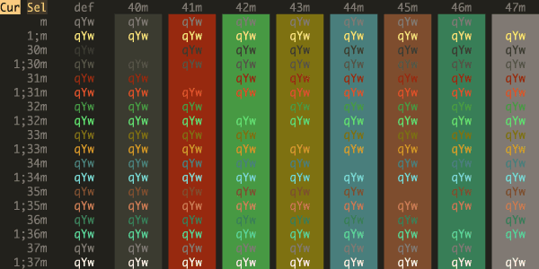
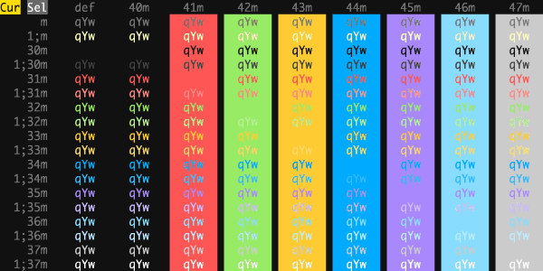
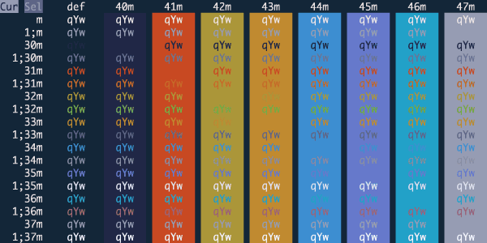
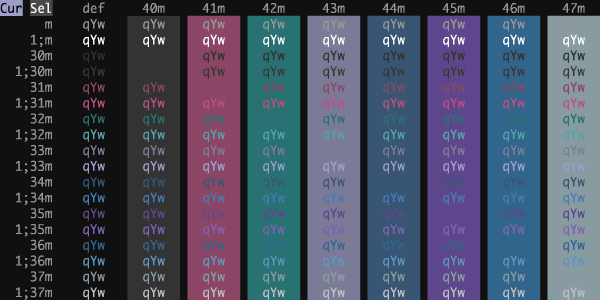
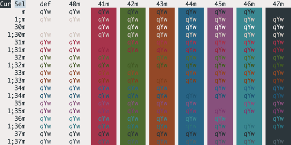

# iTerm Color Schemes

- [Intro](#intro)
- [Installation Instructions](#installation-instructions)
- [Contribute](#contribute)
- [Screenshots](#screenshots)
- [Credits](#credits)
- [Extra](#extra)
  - [X11 Installation](#x11-installation)
  - [Konsole color schemes](#konsole-color-schemes)
  - [Terminator color schemes](#terminator-color-schemes)
  - [Mac OS Terminal color schemes](#terminal-color-schemes)
  - [PuTTY color schemes](#putty-color-schemes)
  - [Xfce Terminal color schemes](#xfce-terminal-color-schemes)
  - [FreeBSD vt(4) color schemes](#freebsd-vt-color-schemes)
  - [Previewing color schemes](#previewing-color-schemes)
  - [MobaXterm color schemes](#mobaxterm-color-schemes)
  - [LXTerminal color schemes](#lxterminal-color-schemes)
  - [Visual Studio Code color schemes](#visual-studio-code-color-schemes)
  - [Windows Terminal color schemes](#windows-terminal-color-schemes)
  - [Alacritty color schemes](#alacritty-color-schemes)

## Intro

This is a set of color schemes for iTerm (aka iTerm2). It also includes ports to Terminal, Konsole, PuTTY, Xresources, XRDB, Remmina, Termite, XFCE, Tilda, FreeBSD VT, Terminator, Kitty, MobaXterm, LXTerminal, Microsoft's Windows Terminal, Visual Studio, Alacritty

Screenshots below and in the [screenshots](screenshots/) directory.

## Installation Instructions

There are 3 ways to install an iTerm theme:

- Direct way via keyboard shortcut:

  - Launch iTerm 2. Get the latest version at <a href="http://www.iterm2.com">iterm2.com</a>
  - Type CMD+i (⌘+i)
  - Navigate to **Colors** tab
  - Click on **Color Presets**
  - Click on **Import**
  - Click on the **schemes** folder
  - Select the **.itermcolors** profiles you would like to import
  - Click on **Color Presets** and choose a color scheme

- Via iTerm preferences (go to the same configuration location as above):

  - Launch iTerm 2. Get the latest version at <a href="http://www.iterm2.com">iterm2.com</a>
  - Click on **iTerm2** menu title
  - Select **Preferences...** option
  - Select **Profiles**
  - Navigate to **Colors** tab
  - Click on **Color Presets**
  - Click on **Import**
  - Select the .itermcolors file(s) of the [schemes](schemes/) you'd like to use \* Click on **Color Presets** and choose a color scheme

- Via Bash script

  - Launch iTerm 2. Get the latest version at <a href="http://www.iterm2.com">iterm2.com</a>
  - Run the following command:

  ```sh
  # Import all color schemes
  tools/import-scheme.sh schemes/*

  # Import all color schemes (verbose mode)
  tools/import-scheme.sh -v schemes/*

  # Import specific color schemes (quotations are needed for schemes with spaces in name)
  tools/import-scheme.sh 'schemes/SpaceGray Eighties.itermcolors' # by file path
  tools/import-scheme.sh 'SpaceGray Eighties'                     # by scheme name
  tools/import-scheme.sh Molokai 'SpaceGray Eighties'             # import multiple
  ```

  - Restart iTerm 2. (Need to quit iTerm 2 to reload the configuration file.)

## Contribute

### Prerequisites

1. For convenient work with generation scripts, it is recommended to install [pyenv](https://github.com/pyenv/pyenv).
2. Run `pyenv install` inside project folder to install python version from `.python-version` file.
3. Run `pip install -r requirements.txt` to install the project dependencies.

### How to add new theme

Have a great iTerm theme? Send it to me via a Pull Request!

1. Get your theme's`.itermcolors` file.
    - Launch iTerm 2
    - Type CMD+i (⌘+i)
    - Navigate to **Colors** tab
    - Click on **Color Presets**
    - Click on **Export**
    - Save the .itermcolors file
2. Put your theme file into `/schemes/`
    - `mv <your-itermcolors-file> schemes/`
3. Generate other formats for your theme using the `update_all.py` script.
    - `cd tools/ && python3 gen.py` OR
    - `cd tools/ && ./gen.py`
4. If you only want to generate files for your theme, you can specify this with the `-s` flag.
    - `./gen.py -s Dracula`
5. Get a screenshot of your theme using the `screenshotTable.sh` script and ImageMagick. **For screenshot consistency, please have your font set to 13pt Monaco and no transparency on the window.**
    - `cd tools/ && ./screenshotTable.sh` - this will create a color table for your theme that you can screenshot.
    - Use ImageMagick (or some other tool) to resize your image for consistency - `mogrify -resize 600x300\! <path-to-your-screenshot>`
    - Move your screenshot into `screenshots/` - `mv <your-screenshot> screenshots/`
6. Update `README.md` and `screenshots/README.md` to include your theme and screenshot. Also update `CREDITS.md` to credit yourself for your contribution.

### How to add new template

Do you want to convert existing iTerm themes to themes for your favorite terminal/editor/etc?

1. Get config file from your terminal/editor/etc.
2. Change actual colors in config to template placeholders from the list below.
```
  {{ Background_Color }}
  {{ Bold_Color }}
  {{ Cursor_Color }}
  {{ Cursor_Text_Color }}
  {{ Foreground_Color }}
  {{ Selected_Text_Color }}
  {{ Selection_Color }}
  {{ Ansi_0_Color }} // black
  {{ Ansi_1_Color }} // red
  {{ Ansi_2_Color }} // green
  {{ Ansi_3_Color }} // yellow
  {{ Ansi_4_Color }} // blue
  {{ Ansi_5_Color }} // magenta
  {{ Ansi_6_Color }} // cyan
  {{ Ansi_7_Color }} // white
  {{ Ansi_8_Color }} // bright black
  {{ Ansi_9_Color }} // bright red
  {{ Ansi_10_Color }} // bright green
  {{ Ansi_11_Color }} // bright yellow
  {{ Ansi_12_Color }} // bright blue
  {{ Ansi_13_Color }} // bright magenta
  {{ Ansi_14_Color }} // bright cyan
  {{ Ansi_15_Color }} // bright white

  Eeach color has these fields:
    - {{ Background_Color.hex }} for hex representation
    - {{ Background_Color.rgb }} for rgb representation as a "(r, g, b)" string
    - {{ Backgroun_Color.guint16 }} for guint16 representation

  Also you have access to this metadata fields:
    - {{ Guint16_Palette }} with a string containing all ansi colors as guint16 values
    - {{ Dark_Theme }} which contains a sign that the theme is dark
```
3. If you need a new value type for color, add it too `tools/converter.py`
4. Put your template file into `tool/templates`. A folder with schemas will be created based on the filename. And the file extension will remain with all generated ones. Example: `editor.ext` file will generate schemas as `editor/scheme_name.ext`
5. Generate all existing themes for all templates `cd tools/ && ./gen.py`. Or, if you only want to generate schemas for your template, you can use the `-t` flag.
  - `./gen.py -t kitty`
6. If in the process you had to add new dependencies or update the version of python, do not forget to indicate this in `requirements.txt` or `.python-version`.

## Screenshots

### 3024 Day


### 3024 Night


### Abernathy


### Adventure


### AdventureTime


### Afterglow


### Alabaster


### AlienBlood


### Andromeda


### Arcoiris


### Argonaut


### Arthur


### AtelierSulphurpool


### Atom


### Atom One Light


### ayu


### ayu Light


### ayu Mirage


### Aurora


### Banana Blueberry


### Batman


### Belafonte Day


### Belafonte Night


### BirdsOfParadise


### Blazer


### BlueBerry Pie


### BlueDolphin


### Blue Matrix


### Bluloco Dark


### Bluloco Light


### Borland


### Breeze


### Bright Lights


### Broadcast


### Brogrammer


### Builtin Dark


### Builtin Light


### Builtin Pastel Dark


### Builtin Solarized Dark


### Builtin Solarized Light


### Builtin Tango Dark


### Builtin Tango Light


### C64


### Calamity


### CGA


### Chalk


### Chalkboard


### ChallengerDeep


### Chester


### Ciapre


### CLRS


### Cobalt Neon


### Cobalt2


### Coffee


### CrayonPonyFish


### Cyberdyne


### Cyberpunk


### Dark Pastel


### Dark+


### Darkside


### Deep


### Desert


### DimmedMonokai


### Django


### DjangoRebornAgain


### DjangoSmoothy


### Doom One


### Doom Peacock


### DotGov


### Dracula


### Dracula+


### Duckbones


### Duotone Dark


### Earthsong


### Elemental



### Elementary


### ENCOM


### Espresso


### Espresso Libre


### Fairyfloss


### Fahrenheit


### Fideloper


### FirefoxDev


### Firewatch


### FishTank


### Flat


### Flatland


### Floraverse


### Forest Blue


### Framer



### FrontEndDelight


### FunForrest


### Galaxy


### Galizur


### Github


### GitHub Dark


### Glacier


### Grape


### Grass


### Grey-green


### Gruvbox Dark


### Gruvbox Dark Hard


### Gruvbox Light


### Guezwhoz


### Hacktober


### Hardcore


### Harper


### HaX0R_R3D


### HaX0R_GR33N


### HaX0R_BLUE


### Highway


### Hipster Green


### Hivacruz



### Homebrew


### Hopscotch


### Hopscotch 256


### Hurtado


### Hybrid


### IC_Green_PPL


### IC_Orange_PPL


### iceberg


### IDEA Drak


### idleToes


### IR_Black


### Jackie Brown


### Japanesque


### Jellybeans


### JetBrains Darcula


### Jubi


### Kanagawabones


### Kibble


### Kolorit


### Konsolas


### Lab Fox


### Laser


### Later This Evening


### Lavandula


### LiquidCarbon


### LiquidCarbonTransparent


### LiquidCarbonTransparentInverse


### LoveLace


### Man Page


### Mariana


### Material


### MaterialDark


### MaterialDarker


### MaterialDesignColors


### MaterialOcean


### Mathias


### Matrix


### Dark Matrix


### Darker Matrix


### Medallion


### Midnight In Mojave


### Mirage


### Misterioso


### Molokai


### MonaLisa


### Monokai Remastered


### Monokai Soda


### Monokai Vivid


### N0tch2k


### Neobones Dark


### Neobones Light


### Neon


### Neopolitan


### Neutron


### NightLion v1


### NightLion v2


### Night Owlish Light


### Novel


### Nocturnal Winter


### Nord


### Nord-light


### Obsidian


### Ocean


### OceanicMaterial


### Oceanic Next


### Ollie


### One Half Dark


### One Half Light


### Operator Mono Dark


### Overnight Slumber


### Palenight High Contrast


### Pandora


### Paraiso Dark


### PaulMillr


### Pencil Dark


### Pencil Light


### Peppermint


### Piatto Light


### Pnevma


### Popping and Locking


### Primary


### Pro


### Pro Light


### Purple Peter


### Purple Rain


### Rapture


### Raycast Dark


### Raycast Light


### Rebecca


### Red Alert


### Red Planet


### Red Sands


### Relaxed


### Retro


### Rippedcasts


### Rouge 2


### Royal


### Ryuuko


### Sakura


### Scarlet Protocol


### Seafoam Pastel


### SeaShells


### Seoulbones Dark


### Seoulbones Light


### Seti


### Shaman


### Shades-Of-Purple


### Slate


### SleepyHollow


### Smyck


### Snazzy


### SoftServer


### Solarized Darcula (With background image)


### Solarized Darcula (Without background image)


### Solarized Dark - Patched

Some applications assume the ANSI color code 8 is a gray color. Solarized treats
this code as equal to the background. This theme is for people who prefer the
former. See issues [#59][issue-59], [#62][issue-62], and [#63][issue-63] for
more information.


[issue-59]: https://github.com/mbadolato/iTerm2-Color-Schemes/issues/59
[issue-62]: https://github.com/mbadolato/iTerm2-Color-Schemes/issues/62
[issue-63]: https://github.com/mbadolato/iTerm2-Color-Schemes/pull/63

### Solarized Dark Higher Contrast


### SpaceGray


### SpaceGray Eighties


### SpaceGray Eighties Dull


### Spacedust


### Spiderman


### Spring


### Square


### Sublette


### Subliminal


### Sundried


### Symfonic


### synthwave


### Synthwave Alpha


### Synthwave Everything


### Tango Adapted


### Tango Half Adapted


### Teerb


### Terminal Basic


### Thayer Bright


### The Hulk


### Tinacious Design (Dark)


### Tinacious Design (Light)


### TokyoNight


### TokyoNight Storm


### TokyoNight Day


### Tomorrow


### Tomorrow Night


### Tomorrow Night Blue


### Tomorrow Night Bright


### Tomorrow Night Eighties


### Tomorrow Night Burns


### ToyChest


### Treehouse


### Twilight


### Ubuntu


### UltraViolent


### UltraDark


### Under The Sea


### Unikitty


### Urple


### Vaughn


### VibrantInk


### Vimbones


### Violet Light


### Violet Dark


### WarmNeon


### Wez


### Whimsy


### WildCherry


### Wilmersdorf


### Wombat


### Wryan



### Zenbones



### Zenbones Dark


### Zenbones Light


### Zenburn


### Zenburned


### Zenwritten Dark


### Zenwritten Light


## Credits

The schemes Novel, Espresso, Grass, Homebrew, Ocean, Pro, Man Page, Red Sands, and Terminal Basic are ports of the schemes of the same name included with the Mac Terminal application. All of Terminal's schemes have now been ported, with the exception of "Solid Colors" (random backgrounds, which iTerm doesn't support) and "Aerogel" (which is hideous).

Credits for all other themes are listed in [CREDITS.md](./CREDITS.md)

If there are other color schemes you'd like to see included, drop me a line!

## Extra

### X11 Installation

To install under the [X Window System](https://www.x.org/):

- Import the .xrdb file of the scheme you'd like to use:

        #include "/home/mbadolato/iTerm2-Color-Schemes/xrdb/Blazer.xrdb"

- Use the `#define`s provided by the imported .xrdb file:

        Rxvt*color0:       Ansi_0_Color
        Rxvt*color1:       Ansi_1_Color
        Rxvt*color2:       Ansi_2_Color
        Rxvt*color3:       Ansi_3_Color
        Rxvt*color4:       Ansi_4_Color
        Rxvt*color5:       Ansi_5_Color
        Rxvt*color6:       Ansi_6_Color
        Rxvt*color7:       Ansi_7_Color
        Rxvt*color8:       Ansi_8_Color
        Rxvt*color9:       Ansi_9_Color
        Rxvt*color10:      Ansi_10_Color
        Rxvt*color11:      Ansi_11_Color
        Rxvt*color12:      Ansi_12_Color
        Rxvt*color13:      Ansi_13_Color
        Rxvt*color14:      Ansi_14_Color
        Rxvt*color15:      Ansi_15_Color
        Rxvt*colorBD:      Bold_Color
        Rxvt*colorIT:      Italic_Color
        Rxvt*colorUL:      Underline_Color
        Rxvt*foreground:   Foreground_Color
        Rxvt*background:   Background_Color
        Rxvt*cursorColor:  Cursor_Color

        XTerm*color0:      Ansi_0_Color
        XTerm*color1:      Ansi_1_Color
        XTerm*color2:      Ansi_2_Color
        XTerm*color3:      Ansi_3_Color
        XTerm*color4:      Ansi_4_Color
        XTerm*color5:      Ansi_5_Color
        XTerm*color6:      Ansi_6_Color
        XTerm*color7:      Ansi_7_Color
        XTerm*color8:      Ansi_8_Color
        XTerm*color9:      Ansi_9_Color
        XTerm*color10:     Ansi_10_Color
        XTerm*color11:     Ansi_11_Color
        XTerm*color12:     Ansi_12_Color
        XTerm*color13:     Ansi_13_Color
        XTerm*color14:     Ansi_14_Color
        XTerm*color15:     Ansi_15_Color
        XTerm*colorBD:     Bold_Color
        XTerm*colorIT:     Italic_Color
        XTerm*colorUL:     Underline_Color
        XTerm*foreground:  Foreground_Color
        XTerm*background:  Background_Color
        XTerm*cursorColor: Cursor_Color

- Store the above snippets in a file and pass it in:

        xrdb -merge YOUR_FILE_CONTAINING_ABOVE_SNIPPETS

- Open new XTerm or Rxvt windows to see the changes.

- Adapt this procedure to other terminals as needed.

### Terminator color schemes

Edit your Terminator configuration file (located in: `$HOME/.config/terminator/config`) and add the configurations for the theme(s) you'd like to use the `[profiles]` section. The `terminator/` directory contains the config snippets you'll need. Just paste the configurations into the `[profiles]` sections, and you're good to go!

At a minimum, this is all you need. You can customize the fonts and other aspects as well, if you wish. See the Terminator documentation for more details.

An example config file that includes the code snippet for the Symfonic theme would look like this:

```ini
[global_config]
    [keybindings]
    [profiles]
      [[default]]
        palette = "#1a1a1a:#f4005f:#98e024:#fa8419:#9d65ff:#f4005f:#58d1eb:#c4c5b5:#625e4c:#f4005f:#98e024:#e0d561:#9d65ff:#f4005f:#58d1eb:#f6f6ef"
        background_image = None
        use_system_font = False
        cursor_color = "#f6f7ec"
        foreground_color = "#c4c5b5"
        font = Source Code Pro Light 11
        background_color = "#1a1a1a"
      [[Symfonic]]
        palette = "#000000:#dc322f:#56db3a:#ff8400:#0084d4:#b729d9:#ccccff:#ffffff:#1b1d21:#dc322f:#56db3a:#ff8400:#0084d4:#b729d9:#ccccff:#ffffff"
        background_color = "#000000"
        cursor_color = "#dc322f"
        foreground_color = "#ffffff"
        background_image = None
    [layouts]
      [[default]]
        [[[child1]]]
          type = Terminal
          parent = window0
        [[[window0]]]
          type = Window
          parent = ""
    [plugins]
```

### Konsole color schemes

Copy the themes from the `konsole` directory to `$HOME/.config/konsole` (in some versions of KDE, the theme directory may be located at `$HOME/.local/share/konsole`), restart Konsole and choose your new theme from the profile preferences window.

If you want to make the themes available to all users, copy the .colorscheme files to `/usr/share/konsole`.

### Terminal color schemes

Just double click on selected theme in `terminal` directory

### PuTTY color schemes

#### New Session Method

This method creates a new blank session with JUST colors set properly.

Download the appropriate `colorscheme.reg` file and import the registry changes by right-clicking and choosing Merge. Choose "Yes" when prompted if you're sure. Color scheme will show up as a new PuTTY session with all defaults except entries at `Window > Colours > Adjust the precise colours PuTTY displays`.

#### Modify Session Method

This method modifies an existing session and changes JUST the color settings.

Download the appropriate `colorscheme.reg` file. Open the file with a text editor and change the color scheme portion (`Molokai` below) to match the session you want to modify:

```
[HKEY_CURRENT_USER\Software\SimonTatham\PuTTY\Sessions\Molokai]
- CHANGE TO (EXAMPLE) -
[HKEY_CURRENT_USER\Software\SimonTatham\PuTTY\Sessions\root@localhost]
```

**NOTE**: Some special characters will need to be changed to their Percent-encoded representation (IE, Space as `%20`). To quickly find the right session name view the top-level entries at `HKEY_CURRENT_USER\Software\SimonTatham\PuTTY\Sessions\` with `regedit.exe`.

#### Other PuTTY Recommendations

```
Window > Apprearance
 Font: Consolas, bold, 14-point
 Font quality:
  ( ) Antialiased     ( ) Non-Antialiased
  (O) ClearType       ( ) Default
Window > Colours
 [X] Allow terminal to specify ANSI colours
 [X] Allow terminal to use xterm 256-colour mode
 Indicate bolded text by changing:
  ( ) The font   (O) The colour   ( ) Both
 [ ] Attempt to use logical palettes
 [ ] Use system colours
```

### Xfce Terminal color schemes

Copy the `colorschemes` folder to `~/.local/share/xfce4/terminal/` and restart Terminal.

### FreeBSD vt color schemes

Append your favourite theme from `freebsd_vt/` to `/boot/loader.conf`
or `/boot/loader.conf.local` and reboot.

### MobaXterm color schemes

Copy the theme content from `mobaxterm/` and paste the content to your `MobaXterm.ini` in the corresponding place (`[Colors]`).

### LXTerminal color schemes

Copy the theme content from `lxterminal/` and paste the content to your `lxterminal` in the corresponding place (`[general]`).

### Visual Studio Code color schemes

Copy the theme content from `vscode/` and paste the content to your [UserSettings.json](https://code.visualstudio.com/docs/getstarted/settings).

### Windows Terminal color schemes

Copy the theme content from `windowsterminal/` and paste the content to your `profiles.json` in the corresponding place (`"schemes"`). Then specify the name of your theme by `"colorScheme"` in `"profiles"`.

### Alacritty color schemes

Copy the theme content from `alacritty/` and paste the content to your [alacritty config file](https://github.com/alacritty/alacritty/blob/master/alacritty.yml).

### Previewing color schemes

[preview.rb](tools/preview.rb) is a simple script that allows you to preview
the color schemes without having to import them. It parses .itermcolors files
and applies the colors to the current session using [iTerm's proprietary
escape codes](https://iterm2.com/documentation-escape-codes.html). As noted in
the linked page, it doesn't run on tmux or screen.

```sh
# Apply AdventureTime scheme to the current session
tools/preview.rb schemes/AdventureTime.itermcolors

# Apply the schemes in turn.
# - Press (almost) any key to advance; hit CTRL-C or ESC to stop
# - Press the delete key to go back
tools/preview.rb schemes/*
```

---

iTerm Color Schemes | iTerm2 Color Schemes | iTerm 2 Color Schemes | iTerm Themes | iTerm2 Themes | iTerm 2 Themes

[](https://github.com/igrigorik/ga-beacon)
