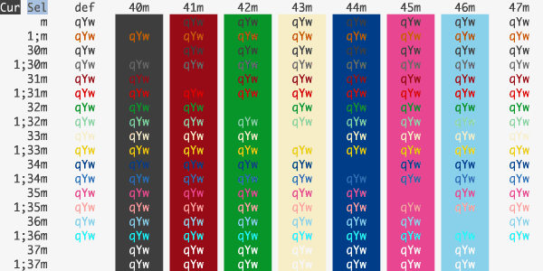
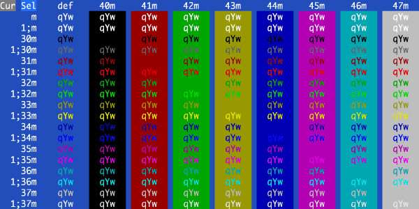

#iTerm Color Schemes#

- [Intro](#intro)
- [Installation Instructions](#installation-instructions)
- [Contribute](#contribute)
- [Screenshots](#screenshots)
- [Credits](#credits)
- [Extra](#extra)
  - [X11 Installation](#x11-installation)
  - [Terminator color schemes](#terminator-color-schemes)

##Intro##
This is a set of color schemes for iTerm (aka iTerm2). Screenshots below and in the [screenshots](screenshots/) directory.

##Installation Instructions##
To install:

* Launch iTerm 2. Get the latest version at <a href="http://www.iterm2.com">iterm2.com</a>
* Type CMD+i (⌘+i)
* Navigate to Colors tab
* Click on Load Presets
* Click on Import
* Select the .itermcolors file(s) of the scheme(s) you'd like to use
* Click on Load Presets and choose a color scheme

##Contribute##
Have a great iTerm theme? Send it to me via a Pull Request! To export your theme settings:

* Launch iTerm 2
* Type CMD+i (⌘+i)
* Navigate to Colors tab
* Click on Load Presets
* Click on Export
* Save the .itermcolors file

To include a screenshot, please generate the output using the [screenshotTable.sh script](tools/screenshotTable.sh) in the ```tools``` directory. 

**For screenshot consistency, please have your font set to 13pt Monaco and no transparency on the window**

##Screenshots##
###AdventureTime###


###AlienBlood###


###BirdsOfParadise###


###Blazer###


###Chalk###


###Chalkboard###


###Ciapre###


###CLRS###


###Cobalt2###


###CrayonPonyFish###


###Dark Pastel###


###Desert###


###DimmedMonokai###


###Dracula###


###Earthsong###


###Elemental###


###Espresso###


###FishTank###


###Flat###


###FrontEndDelight###


###FunForrest###


###Github###



###Grape###


###Grass###


###Harper###


###Highway###


###Hipster Green###


###Homebrew###


###Hurtado###


###Hybrid###


###IC_Green_PPL###


###IC_Orange_PPL###


###idleToes###


###IR_Black###


###Jackie Brown###


###Japanesque###


###Jellybeans###


###Kibble###


###Lavandula###


###LiquidCarbon###


###LiquidCarbonTransparent###


###LiquidCarbonTransparentInverse###


###Mathias###


###Man Page###


###Medallion###


###Misterioso###


###Molokai###


###MonaLisa###


###Monokai Soda###


###Neopolitan###


###NightLion v1###


###NightLion v2###


###Novel###


###Ocean###



###Obsidian###


###Ollie###


###PaulMillr###


###Pencil Dark###


###Pencil Light###


###Pro###


###Red Alert###


###Red Sands###


###Royal###


###Seafoam Pastel###


###SeaShells###


###Seti###


###Shaman###


###Smyck###


###SoftServer###


###Solarized Darcula (With background image)###


###Solarized Darcula (Without background image)###


###Solarized Dark###


###Solarized Light###


###SpaceGray###


###Spacedust###


###Spring###


###Sundried###


###Symfonic###


###Teerb###


###Terminal Basic###


###Thayer Bright###


###Tomorrow###


###Tomorrow Night###


###Tomorrow Night Blue###


###Tomorrow Night Bright###


###Tomorrow Night Eighties###


###ToyChest###


###Treehouse###


###Twilight###


###Urple###


###Vaughn###


###WarmNeon###


###Zenburn###


## Credits
The schemes Novel, Espresso, Grass, Homebrew, Ocean, Pro, Man Page, Red Sands, and Terminal Basic are ports of the schemes of the same name included with the Mac Terminal application. All of Terminal's schemes have now been ported, with the excption of "Solid Colors" (random backgrounds, which iTerm doesn't support) and "Aerogel" (which is hideous).

The scheme idleToes was inspired by the [idleFingers](http://idlefingers.co.uk/) TextMate theme and suggested for inclusion by Seth Wilson.

The scheme Zenburn was inspired by the [Zenburn](http://snk.tuxfamily.org/log/zenburn-terminal-color-scheme.html) version created by Suraj N. Kurapati.

The scheme Symfonic was inspired by the color scheme used in the [documentation](http://symfony.com/doc/current/book/index.html) for the [Symfony](http://www.symfony.com) PHP Framework.

The scheme Github was inspired by the color theme palette used at [Github](http://github.com/) for their UI and in some of their mascot images.

The scheme Solarized Darcula was inspired by the color theme created by [@rickhanlonii](https://github.com/rickhanlonii). There are two screenshots below; one with a background and one without. The background image is included in the backgrounds/ directory and the image must be manually set on the profile's Preferences->Window tab. It's hard to see from the screenshot, but it looks great!

The theme Hurtado was found [here](https://github.com/juanghurtado/dotfiles).

The theme Molokai was based on the [vim colorscheme](https://github.com/tomasr/molokai) of the same name.

The theme Mokokai Soda was found [here](https://github.com/deepsweet/Monokai-Soda-iTerm).

The theme Neopolitan was created by [daytonn](https://github.com/daytonn/iTerm2-Color-Schemes)

The themes Solarized Dark and Solarized Light come from the official [Solarized web site](http://ethanschoonover.com/solarized)

The themes Obsidian and Spacedust were on my hard drive and I don't recall where they came from. If anyone knows, ping me and I'll link back to the authors.

The theme Mathias was created by [mathiasbynens](https://github.com/mathiasbynens/dotfiles)

The LiquidCarbon themes were created by [markcho](https://github.com/markcho/iTerm2_LiquidCarbon)

The NightLion themes were created by [Curvve Media](http://www.curvve.com/blog/category/themes/)

The Tomorrow themes were created by [chriskempson](https://github.com/chriskempson/tomorrow-theme/tree/master/iTerm2)

The Twilight theme was created by [stefri](https://gist.github.com/stefri/1183140)

The Teerb theme was created by [Teerb](https://gist.github.com/teerb/1360453)

The IR_Black theme was found [here](https://gist.github.com/meqif/1238378)

The Misterioso theme was created by [flooose](https://github.com/flooose/misterioso-iterm2)

The Hybrid theme was found [here](https://gist.github.com/luan/6362811)

The Thayer Bright theme was found [here](https://github.com/t3chnoboy/thayer-bright-iTerm)

The Spring theme was found [here](https://github.com/t3chnoboy/spring-iTerm)

The Smyck theme was found [here](https://github.com/hukl/Smyck-Color-Scheme)

The Cobalt2 theme was created by [wesbos](https://github.com/wesbos/Cobalt2-iterm)

The WarmNeon theme was ported from [PyCharm](http://www.jetbrains.com/pycharm/) by [firewut](https://github.com/firewut)

The SpaceGray theme was created by [ryentzer](https://github.com/ryentzer/SpaceGray-iTerm)

The Jellybeans theme was created by [qtpi](https://github.com/qtpi/Jellybeans.itermcolors)

The PaulMillr theme was created by [paulmillr](https://github.com/paulmillr/dotfiles/tree/master/terminal) and ported to iTerm by me

The Harper theme was created by [idleberg](https://github.com/idleberg/Harper-iTerm2)

The CLRS theme was created by [jasonlong](https://github.com/jasonlong/iterm-clrs)

The Dracula theme was created by [zenorocha](https://github.com/zenorocha/dracula-theme)

The themes AdventureTime, AlienBlood, BirdsOfParadise, Ciapre, CrayonPonyFish, DimmedMonokai, Earthsong, Elemental, FishTank, FrontEndDelight, FunForrest, Grape, Highway, IC_Green_PPL, IC_Orange_PPL, Lavandula, Medallion, MonaLisa, Ollie, Royal, SeaShells, Shaman, SoftServer, Sundried, ToyChest, Treehouse, and Urple were created by [zdj](https://github.com/zdj/themes/tree/master/iterm2)

The Japanesque theme was created by [aereal](https://github.com/aereal/dotfiles/blob/master/colors/Japanesque/Japanesque.itermcolors)

The Seti theme was created by [jesseweed](https://github.com/jesseweed/seti-syntax/) and ported to iTerm2 by [philduffy](https://github.com/philduffy/seti-iterm) and slightly modified to make the ANSI blacks have a little more contrast

The Hipster Green and Jackie Brown themes were created by [Unkulunkulu](https://github.com/Unkulunkulu)

The Chalk theme was created by [achalv](https://github.com/achalv/chalk)

The Pencil Dark and Pencil Light themes were created by [mattly](https://github.com/mattly/iterm-colors-pencil)

The Flat theme was created by [ahmetsulek](https://github.com/ahmetsulek/flat-terminal)

If there are other color schemes you'd like to see included, drop me a line!

## Extra
###X11 Installation###
To install under the [X Window System](http://www.x.org/):

* Import the .xrdb file of the scheme you'd like to use:

        #include "/home/mbadolato/iTerm2-Color-Schemes/xrdb/Blazer.xrdb"

* Use the `#define`s provided by the imported .xrdb file:

        Rxvt*color0:       Ansi_0_Color
        Rxvt*color1:       Ansi_1_Color
        Rxvt*color2:       Ansi_2_Color
        Rxvt*color3:       Ansi_3_Color
        Rxvt*color4:       Ansi_4_Color
        Rxvt*color5:       Ansi_5_Color
        Rxvt*color6:       Ansi_6_Color
        Rxvt*color7:       Ansi_7_Color
        Rxvt*color8:       Ansi_8_Color
        Rxvt*color9:       Ansi_9_Color
        Rxvt*color10:      Ansi_10_Color
        Rxvt*color11:      Ansi_11_Color
        Rxvt*color12:      Ansi_12_Color
        Rxvt*color13:      Ansi_13_Color
        Rxvt*color14:      Ansi_14_Color
        Rxvt*color15:      Ansi_15_Color
        Rxvt*colorBD:      Bold_Color
        Rxvt*colorIT:      Italic_Color
        Rxvt*colorUL:      Underline_Color
        Rxvt*foreground:   Foreground_Color
        Rxvt*background:   Background_Color
        Rxvt*cursorColor:  Cursor_Color

        XTerm*color0:      Ansi_0_Color
        XTerm*color1:      Ansi_1_Color
        XTerm*color2:      Ansi_2_Color
        XTerm*color3:      Ansi_3_Color
        XTerm*color4:      Ansi_4_Color
        XTerm*color5:      Ansi_5_Color
        XTerm*color6:      Ansi_6_Color
        XTerm*color7:      Ansi_7_Color
        XTerm*color8:      Ansi_8_Color
        XTerm*color9:      Ansi_9_Color
        XTerm*color10:     Ansi_10_Color
        XTerm*color11:     Ansi_11_Color
        XTerm*color12:     Ansi_12_Color
        XTerm*color13:     Ansi_13_Color
        XTerm*color14:     Ansi_14_Color
        XTerm*color15:     Ansi_15_Color
        XTerm*colorBD:     Bold_Color
        XTerm*colorIT:     Italic_Color
        XTerm*colorUL:     Underline_Color
        XTerm*foreground:  Foreground_Color
        XTerm*background:  Background_Color
        XTerm*cursorColor: Cursor_Color

* Store the above snippets in a file and pass it in:

        $ xrdb -merge YOUR_FILE_CONTAINING_ABOVE_SNIPPETS

* Open new XTerm or Rxvt windows to see the changes.

* Adapt this procedure to other terminals as needed.

###Terminator color schemes###

Edit your Terminator configuration file (located in: `$HOME/.config/terminator/config`) and add the configurations for the theme(s) you'd like to use the ``[profiles]`` section. The `terminator/` directory contains the config snippets you'll need. Just paste the configurations into the `[profiles]` sections, and you're good to go!  

At a minimum, this is all you need. You can customize the fonts and other aspects as well, if you wish. See the Terminator documentation for more details.

An example config file that includes the code snippet for the Symfonic theme would look like this:

```ini
[global_config]
    [keybindings]
    [profiles]
      [[default]]
        palette = "#1a1a1a:#f4005f:#98e024:#fa8419:#9d65ff:#f4005f:#58d1eb:#c4c5b5:#625e4c:#f4005f:#98e024:#e0d561:#9d65ff:#f4005f:#58d1eb:#f6f6ef"
        background_image = None
        use_system_font = False
        cursor_color = "#f6f7ec"
        foreground_color = "#c4c5b5"
        font = Source Code Pro Light 11
        background_color = "#1a1a1a"
      [[Symfonic]]
        palette = "#000000:#dc322f:#56db3a:#ff8400:#0084d4:#b729d9:#ccccff:#ffffff:#1b1d21:#dc322f:#56db3a:#ff8400:#0084d4:#b729d9:#ccccff:#ffffff"
        background_color = "#000000"
        cursor_color = "#dc322f"
        foreground_color = "#ffffff"
        background_image = None
    [layouts]
      [[default]]
        [[[child1]]]
          type = Terminal
          parent = window0
        [[[window0]]]
          type = Window
          parent = ""
    [plugins]
```

----

iTerm Color Schemes | iTerm2 Color Schemes | iTerm 2 Color Schemes | iTerm Themes | iTerm2 Themes | iTerm 2 Themes

[](https://github.com/igrigorik/ga-beacon)

