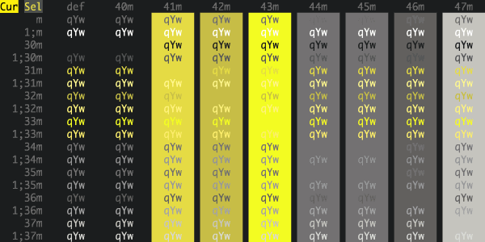

#iTerm Color Schemes#

- [Intro](#intro)
- [Installation Instructions](#installation-instructions)
- [Contribute](#contribute)
- [Screenshots](#screenshots)
- [Credits](#credits)
- [Extra](#extra)
  - [X11 Installation](#x11-installation)
  - [Konsole color schemes](#konsole-color-schemes)
  - [Terminator color schemes](#terminator-color-schemes)
  - [Mac OS Terminal color schemes](#terminal-color-schemes)
  - [PuTTY color schemes](#putty-color-schemes)
  - [Previewing color schemes](#previewing-color-schemes)

##Intro##
This is a set of color schemes for iTerm (aka iTerm2). Screenshots below and in the [screenshots](screenshots/) directory.

##Installation Instructions##
To install:

* Launch iTerm 2. Get the latest version at <a href="http://www.iterm2.com">iterm2.com</a>
* Type CMD+i (⌘+i)
* Navigate to **Colors** tab
* Click on **Color Presets**
* Click on **Import**
* Select the .itermcolors file(s) of the scheme(s) you'd like to use
* Click on **Color Presets** and choose a color scheme

##Contribute##
Have a great iTerm theme? Send it to me via a Pull Request! To export your theme settings:

* Launch iTerm 2
* Type CMD+i (⌘+i)
* Navigate to **Colors** tab
* Click on **Color Presets**
* Click on **Export**
* Save the .itermcolors file

To include a screenshot, please generate the output using the [screenshotTable.sh script](tools/screenshotTable.sh) in the ```tools``` directory.

**For screenshot consistency, please have your font set to 13pt Monaco and no transparency on the window**

##Screenshots##
###3024 Day###


###3024 Night###


###AdventureTime###


###Afterglow###


###AlienBlood###


###Argonaut###


###Arthur###


###AtelierSulphurpool###


###Atom###


###Atom One Light###


###ayu###


###ayu Light###


###Batman###



###Belafonte Day###


###Belafonte Night###


###BirdsOfParadise###


###Blazer###


###Borland###


###Bright Lights###


###Broadcast###


###Brogrammer###


###C64###


###Chalk###


###Chalkboard###


###Ciapre###


###CLRS###


###Cobalt Neon###


###Cobalt2###


###CrayonPonyFish###


###Dark Pastel###


###Darkside###


###Deep###


###Desert###


###DimmedMonokai###


###DotGov###


###Dracula###


###Duotone Dark###


###Earthsong###


###Elemental###


###Elementary###


###ENCOM###


###Espresso###


###Espresso Libre###


###Fideloper###


###FirefoxDev###


###Firewatch###


###FishTank###


###Flat###


###Flatland###


###Floraverse###


###Forest Blue###


###FrontEndDelight###


###FunForrest###


###Galaxy###


###Github###


###Glacier###


###Grape###


###Grass###


###Gruvbox Dark###


###Hardcore###


###Harper###


###Highway###


###Hipster Green###


###Homebrew###


###Hurtado###


###Hybrid###


###IC_Green_PPL###


###IC_Orange_PPL###


###idleToes###


###IR_Black###


###Jackie Brown###


###Japanesque###


###Jellybeans###


###JetBrains Darcula###


###Kibble###


###Later This Evening ###


###Lavandula###


###LiquidCarbon###


###LiquidCarbonTransparent###


###LiquidCarbonTransparentInverse###


###Man Page###


###Material###


###MaterialDark###


###Mathias###


###Medallion###


###Misterioso###


###Molokai###


###MonaLisa###


###Monokai Soda###


###Monokai Vivid###


###N0tch2k###


###Neopolitan###


###Neutron###


###NightLion v1###


###NightLion v2###


###Novel###


###Obsidian###


###Ocean###


###OceanicMaterial###


###Ollie###


###One Half Dark###


###One Half Light###


###Pandora###


###Parasio Dark###


###PaulMillr###


###Pencil Dark###


###Pencil Light###


###Piatto Light###


###Pnevma###


###Pro###


###Red Alert###


###Red Sands###


###Rippedcasts###


###Royal###


###Ryuuko###


###Seafoam Pastel###


###SeaShells###


###Seti###


###Shaman###


###Slate###


###Smyck###


###SoftServer###


###Solarized Darcula (With background image)###


###Solarized Darcula (Without background image)###


###Solarized Dark###


###Solarized Dark - Patched###

Some applications assume the ANSI color code 8 is a gray color. Solarized treats
this code as equal to the background. This theme is for people who prefer the
former. See issues [#59][issue-59], [#62][issue-62], and [#63][issue-63] for
more information.


[issue-59]: https://github.com/mbadolato/iTerm2-Color-Schemes/issues/59
[issue-62]: https://github.com/mbadolato/iTerm2-Color-Schemes/issues/62
[issue-63]: https://github.com/mbadolato/iTerm2-Color-Schemes/pull/63

###Solarized Dark Higher Contrast###


###Solarized Light###


###SpaceGray###


###SpaceGray Eighties###


###SpaceGray Eighties Dull###


###Spacedust###


###Spiderman###


###Spring###


###Square###


###Sundried###


###Symfonic###


###Teerb###


###Terminal Basic###


###Thayer Bright###


###The Hulk###


###Tomorrow###


###Tomorrow Night###


###Tomorrow Night Blue###


###Tomorrow Night Bright###


###Tomorrow Night Eighties###


###ToyChest###


###Treehouse###


###Twilight###


###Ubuntu###


###Under The Sea###


###Urple###


###Vaughn###


###VibrantInk###


###Violet Light###


###Violet Dark###


###WarmNeon###


###Wez###


###WildCherry###


###Wombat###


###Wryan###


###Zenburn###


## Credits
The schemes Novel, Espresso, Grass, Homebrew, Ocean, Pro, Man Page, Red Sands, and Terminal Basic are ports of the schemes of the same name included with the Mac Terminal application. All of Terminal's schemes have now been ported, with the excption of "Solid Colors" (random backgrounds, which iTerm doesn't support) and "Aerogel" (which is hideous).

The scheme Violet was created by [ashfinal](https://github.com/ashfinal/vim-colors-violet).

The scheme idleToes was inspired by the [idleFingers](http://www.idlefingers.co.uk/) TextMate theme and suggested for inclusion by Seth Wilson.

The scheme Zenburn was inspired by the [Zenburn](http://sunaku.github.io/zenburn-terminal-color-scheme.html) version created by Suraj N. Kurapati.

The scheme Symfonic was inspired by the color scheme used in the [documentation](http://symfony.com/doc/current/book/index.html) for the [Symfony](http://www.symfony.com) PHP Framework.

The scheme Github was inspired by the color theme palette used at [Github](https://github.com/) for their UI and in some of their mascot images.

The scheme Solarized Darcula was inspired by the color theme created by [@rickhanlonii](https://github.com/rickhanlonii). There are two screenshots below; one with a background and one without. The background image is included in the backgrounds/ directory and the image must be manually set on the profile's Preferences->Window tab. It's hard to see from the screenshot, but it looks great!

The theme Hurtado was found [here](https://github.com/juanghurtado/dotfiles).

The theme Molokai was based on the [vim colorscheme](https://github.com/tomasr/molokai) of the same name.

The theme Monokai Soda was found [here](https://github.com/deepsweet/Monokai-Soda-iTerm).

The theme Monokai Vivid was created by [vitalymak](https://github.com/vitalymak/iTerm2-Color-Schemes).

The theme Neopolitan was created by [daytonn](https://github.com/daytonn/iTerm2-Color-Schemes)

The themes Solarized Dark and Solarized Light come from the official [Solarized web site](http://ethanschoonover.com/solarized)

The Obsidian theme was on my hard drive and I don't recall where it came from. If anyone knows, ping me and I'll link back to the author(s).

The Spacedust theme was created by [mhallendal](https://github.com/mhallendal/spacedust-theme) and ported to iTerm by [Couto](https://github.com/Couto)

The theme Mathias was created by [mathiasbynens](https://github.com/mathiasbynens/dotfiles)

The LiquidCarbon themes were created by [markcho](https://github.com/markcho/iTerm2_LiquidCarbon)

The NightLion themes were created by [Curvve Media](http://www.curvve.com/blog/category/themes/)

The Tomorrow themes were created by [chriskempson](https://github.com/chriskempson/tomorrow-theme/tree/master/iTerm2)

The Twilight theme was created by [stefri](https://gist.github.com/stefri/1183140)

The Teerb theme was created by [Teerb](https://gist.github.com/teerb/1360453)

The IR_Black theme was found [here](https://gist.github.com/meqif/1238378)

The Misterioso theme was created by [flooose](https://github.com/flooose/misterioso-iterm2)

The Hybrid theme was found [here](https://gist.github.com/luan/6362811)

The Thayer Bright theme was found [here](https://github.com/t3chnoboy/thayer-bright-iTerm)

The Spring theme was found [here](https://github.com/t3chnoboy/spring-iTerm)

The Smyck theme was found [here](https://github.com/hukl/Smyck-Color-Scheme)

The Forest Blue theme was found [here](https://github.com/olkinn/forest-blue-iTerm)

The Cobalt2 theme was created by [wesbos](https://github.com/wesbos/Cobalt2-iterm)

The WarmNeon theme was ported from [PyCharm](http://www.jetbrains.com/pycharm/) by [firewut](https://github.com/firewut)

The SpaceGray theme was created by [ryentzer](https://github.com/ryentzer/SpaceGray-iTerm)

The Jellybeans theme was created by [qtpi](https://github.com/qtpi/Jellybeans.itermcolors)

The PaulMillr theme was created by [paulmillr](https://github.com/paulmillr/dotfiles/tree/master/terminal) and ported to iTerm by me

The Harper theme was created by [idleberg](https://github.com/idleberg/Harper-iTerm2)

The CLRS theme was created by [jasonlong](https://github.com/jasonlong/iterm-clrs)

The Dracula theme was created by [zenorocha](https://github.com/zenorocha/dracula-theme)

The themes AdventureTime, AlienBlood, BirdsOfParadise, Ciapre, CrayonPonyFish, DimmedMonokai, Earthsong, Elemental, FishTank, FrontEndDelight, FunForrest, Grape, Highway, IC_Green_PPL, IC_Orange_PPL, Lavandula, Medallion, MonaLisa, Ollie, Royal, SeaShells, Shaman, SoftServer, Sundried, ToyChest, Treehouse, and Urple were created by [zdj](https://github.com/zdj/themes/tree/master/iterm2)

The Japanesque theme was created by [aereal](https://github.com/aereal/dotfiles/blob/master/colors/Japanesque/Japanesque.itermcolors)

The Seti theme was created by [jesseweed](https://github.com/jesseweed/seti-syntax/) and ported to iTerm2 by [philduffy](https://github.com/willmanduffy/seti-iterm) and slightly modified to make the ANSI blacks have a little more contrast

The Hipster Green and Jackie Brown themes were created by [Unkulunkulu](https://github.com/Unkulunkulu)

The Chalk theme was created by [achalv](https://github.com/achalv/chalk)

The Pencil Dark and Pencil Light themes were created by [mattly](https://github.com/mattly/iterm-colors-pencil)

The Flat theme was created by [ahmetsulek](https://github.com/ahmetsulek/flat-terminal)

The Atom, Brogrammer, Glacier and Darkside themes were created by [bahlo](https://github.com/bahlo/iterm-colors)

The Afterglow theme was created by [yabatadesign](https://github.com/YabataDesign/afterglow-itermcolors)

The Broadcast theme was created by [vinkla](https://github.com/vinkla/broadcast-theme)

The Arthur, N0tch2k, Pnevma, Square, and Wryan themes were created by [baskerville](https://github.com/baskerville/iTerm-2-Color-Themes)

The Belafonte Day, Belafonte Night, Paraiso Dark, and C64 themes were created by [idleberg](https://github.com/idleberg)

The 3024 Day and 3024 Night themes were created by [0x3024](https://github.com/0x3024)

The Argonaut theme was created by [effkay](https://github.com/effkay/iTerm-argonaut)

The Espresso Libre theme was created by [jurgemaister](https://github.com/jurgemaister/Espresso-Libre)

The Hardcore theme was created by [hardcore](https://github.com/hardcore/iTerm-colors)

The Rippedcasts theme was created by [mdw123](https://github.com/mdw123/rippedcasts)

The Solorized Dark Higher Contrast theme was created by [heisters](https://gist.github.com/heisters/1015503)

The VibrantInk theme was created by [asanghi](https://github.com/asanghi/vibrantinklion)

The Wez theme was created by [wez](https://gist.github.com/wez/850268/)

The Wombat theme was created by [djoyner](https://github.com/djoyner/iTerm2-wombat)

The WildCherry theme was created by [mashaal](https://github.com/mashaal/wild-cherry)

The Flatland theme was created by [realchaseadams](http://www.snip2code.com/Snippet/148193/Flatland-color-scheme-for-iTerm2)

The Neutron theme was created by [Ch4s3](https://github.com/Ch4s3/iTerm2-Neutron)

The Fideloper theme was inspired by [Fideloper](http://fideloper.com/)

The Later This Evening theme was created by [vilhalmer](https://github.com/vilhalmer/System/tree/master/terminal-themes)

The Galaxy theme was created by [jglovier](https://github.com/jglovier/galaxy-theme-iterm)

The Slate theme was created by [deneshshan](https://github.com/deneshshan)

The SpaceGray Eighties and SpaceGray Eighties Dull themes were created by [mhkeller](https://github.com/mhkeller/spacegray-eighties-iterm)

The Borland theme was created by [delip](https://gist.github.com/delip/9e16c606d9331d69d681)

The Cobalt Neon theme was created by [vazquez](https://github.com/vazquez/cobalt-neon-iterm)

The AtelierSulphurpool theme was created by [atelierbram](http://atelierbram.github.io/syntax-highlighting/atelier-schemes/sulphurpool/)

The Batman, Spiderman, and The Hulk themes were created by [pyrophos](https://github.com/pyrophos)

The ENCOM theme was created by [Josh Braun](http://wideaperture.net)

The Floraverse theme was created by [papayakitty](http://floraverse.com/)

The Material and MaterialDark themes were created by [stoeffel](https://github.com/stoeffel/material-iterm)

The OceanicMaterial theme was created by [rahulpatel](https://github.com/rahulpatel)

The AtomOneLight theme was created by [iamstarkov](https://github.com/iamstarkov)

The Piatto Light theme was created by [kovv](https://github.com/kovv)

The DotGov theme was inspired by the color palette used in the [U.S. Web Design Standards](https://standards.usa.gov/visual-style/)

The DuoTone Dark theme was created by [chibicode](http://chibicode.com) based on [simurai](https://github.com/simurai)'s [duotone-dark](https://github.com/simurai/duotone-dark-syntax) Atom theme.

The JetBrains Darcula theme was created by [vitstr](https://github.com/vitstr)

The Bright Lights theme was created by [tw15egan](https://github.com/tw15egan)

The Ubuntu theme was inspired by default Ubuntu's console colors. Created by [Maximus](http://superuser.com/questions/497240/ubuntu-purple-terminal-colors-in-conemu) and ported to iTerm2 by [stepin](https://github.com/stepin).

The Under The Sea theme was created by [peterpme](https://github.com/peterpme)

The One Half themes were created by [sonph](https://github.com/sonph), based on Atom's One with some tweakings.

The FirefoxDev theme was created by [Or3stis](https://github.com/Or3stis)

The Ryuuko theme was created by [dylanaraps](https://github.com/dylanaraps) and added by [iandrewt](https://github.com/iandrewt)

The Firewatch theme was created by [Sebastian Szturo](https://github.com/SebastianSzturo) as an [atom syntax theme](https://atom.io/themes/firewatch-syntax) and ported to an iTerm scheme by [Ben Styles](https://github.com/leeds-ebooks). It was originally inspired by the [Firewatch game](http://www.firewatchgame.com/).

The Pandora theme was created by [milosmatic](https://github.com/milosmatic/Pandora-iterm)

The Elementary OS  theme was created by [elementary.io](https://elementary.io/) and added by [987poiuytrewq](https://github.com/987poiuytrewq)

The Gruvbox Dark  theme was created by [morhetz](https://github.com/morhetz) and added by [mcchrish](https://github.com/mcchrish)

The Ayu and Ayu Light  themes were created by [alebcay](https://github.com/alebcay)

The Deep  theme was created by [ADoyle](https://github.com/adoyle-h)

If there are other color schemes you'd like to see included, drop me a line!

## Extra
###X11 Installation###
To install under the [X Window System](https://www.x.org/):

* Import the .xrdb file of the scheme you'd like to use:

        #include "/home/mbadolato/iTerm2-Color-Schemes/xrdb/Blazer.xrdb"

* Use the `#define`s provided by the imported .xrdb file:

        Rxvt*color0:       Ansi_0_Color
        Rxvt*color1:       Ansi_1_Color
        Rxvt*color2:       Ansi_2_Color
        Rxvt*color3:       Ansi_3_Color
        Rxvt*color4:       Ansi_4_Color
        Rxvt*color5:       Ansi_5_Color
        Rxvt*color6:       Ansi_6_Color
        Rxvt*color7:       Ansi_7_Color
        Rxvt*color8:       Ansi_8_Color
        Rxvt*color9:       Ansi_9_Color
        Rxvt*color10:      Ansi_10_Color
        Rxvt*color11:      Ansi_11_Color
        Rxvt*color12:      Ansi_12_Color
        Rxvt*color13:      Ansi_13_Color
        Rxvt*color14:      Ansi_14_Color
        Rxvt*color15:      Ansi_15_Color
        Rxvt*colorBD:      Bold_Color
        Rxvt*colorIT:      Italic_Color
        Rxvt*colorUL:      Underline_Color
        Rxvt*foreground:   Foreground_Color
        Rxvt*background:   Background_Color
        Rxvt*cursorColor:  Cursor_Color

        XTerm*color0:      Ansi_0_Color
        XTerm*color1:      Ansi_1_Color
        XTerm*color2:      Ansi_2_Color
        XTerm*color3:      Ansi_3_Color
        XTerm*color4:      Ansi_4_Color
        XTerm*color5:      Ansi_5_Color
        XTerm*color6:      Ansi_6_Color
        XTerm*color7:      Ansi_7_Color
        XTerm*color8:      Ansi_8_Color
        XTerm*color9:      Ansi_9_Color
        XTerm*color10:     Ansi_10_Color
        XTerm*color11:     Ansi_11_Color
        XTerm*color12:     Ansi_12_Color
        XTerm*color13:     Ansi_13_Color
        XTerm*color14:     Ansi_14_Color
        XTerm*color15:     Ansi_15_Color
        XTerm*colorBD:     Bold_Color
        XTerm*colorIT:     Italic_Color
        XTerm*colorUL:     Underline_Color
        XTerm*foreground:  Foreground_Color
        XTerm*background:  Background_Color
        XTerm*cursorColor: Cursor_Color

* Store the above snippets in a file and pass it in:

        $ xrdb -merge YOUR_FILE_CONTAINING_ABOVE_SNIPPETS

* Open new XTerm or Rxvt windows to see the changes.

* Adapt this procedure to other terminals as needed.

###Terminator color schemes###

Edit your Terminator configuration file (located in: `$HOME/.config/terminator/config`) and add the configurations for the theme(s) you'd like to use the ``[profiles]`` section. The `terminator/` directory contains the config snippets you'll need. Just paste the configurations into the `[profiles]` sections, and you're good to go!

At a minimum, this is all you need. You can customize the fonts and other aspects as well, if you wish. See the Terminator documentation for more details.

An example config file that includes the code snippet for the Symfonic theme would look like this:

```ini
[global_config]
    [keybindings]
    [profiles]
      [[default]]
        palette = "#1a1a1a:#f4005f:#98e024:#fa8419:#9d65ff:#f4005f:#58d1eb:#c4c5b5:#625e4c:#f4005f:#98e024:#e0d561:#9d65ff:#f4005f:#58d1eb:#f6f6ef"
        background_image = None
        use_system_font = False
        cursor_color = "#f6f7ec"
        foreground_color = "#c4c5b5"
        font = Source Code Pro Light 11
        background_color = "#1a1a1a"
      [[Symfonic]]
        palette = "#000000:#dc322f:#56db3a:#ff8400:#0084d4:#b729d9:#ccccff:#ffffff:#1b1d21:#dc322f:#56db3a:#ff8400:#0084d4:#b729d9:#ccccff:#ffffff"
        background_color = "#000000"
        cursor_color = "#dc322f"
        foreground_color = "#ffffff"
        background_image = None
    [layouts]
      [[default]]
        [[[child1]]]
          type = Terminal
          parent = window0
        [[[window0]]]
          type = Window
          parent = ""
    [plugins]
```

###Konsole color schemes###

Copy the themes from the `konsole` directory to `$HOME/.config/konsole`, restart Konsole and choose your new theme from the profile preferences window.

If you want to make the themes available to all users, copy the .colorscheme files to `/usr/share/konsole`.

###Terminal color schemes###
Just double click on selected theme in `terminal` directory

###PuTTY color schemes###

####New Session Method####
This method creates a new blank session with JUST colors set properly.

Download the appropriate `colorscheme.reg` file and import the registry changes by right-clicking and choosing Merge. Choose "Yes" when prompted if you're sure. Color scheme will show up as a new PuTTY session with all defaults except entries at `Window > Colours > Adjust the precise colours PuTTY displays`.

####Modify Session Method####
This method modifies an existing session and changes JUST the color settings.

Download the appropriate `colorscheme.reg` file. Open the file with a text editor and change the color scheme portion (`Molokai` below) to match the session you want to modify:

```
[HKEY_CURRENT_USER\Software\SimonTatham\PuTTY\Sessions\Molokai]
- CHANGE TO (EXAMPLE) -
[HKEY_CURRENT_USER\Software\SimonTatham\PuTTY\Sessions\root@localhost]
```

**NOTE**: Some special characters will need to be changed to their Percent-encoded representation (IE, Space as `%20`). To quickly find the right session name view the top-level entries at `HKEY_CURRENT_USER\Software\SimonTatham\PuTTY\Sessions\` with `regedit.exe`.

####Other PuTTY Recommendations####

```
Window > Apprearance
	Font: Consolas, bold, 14-point
	Font quality:
		( ) Antialiased     ( ) Non-Antialiased
		(O) ClearType       ( ) Default
Window > Colours
	[X] Allow terminal to specify ANSI colours
	[X] Allow terminal to use xterm 256-colour mode
	Indicate bolded text by changing:
		( ) The font   (O) The colour   ( ) Both
	[ ] Attempt to use logical palettes
	[ ] Use system colours
```


###Previewing color schemes###

[preview.rb](tools/preview.rb) is a simple script that allows you to preview
the color schemes without having to import them. It parses .itermcolors files
and applies the colors to the current session using [iTerm's proprietary
escape codes](https://iterm2.com/documentation-escape-codes.html). As noted in
the linked page, it doesn't run on tmux or screen.

```sh
# Apply AdventureTime scheme to the current session
tools/preview.rb schemes/AdventureTime.itermcolors

# Apply the schemes in turn.
# - Press any key to advance; hit CTRL-C or ESC to stop
tools/preview.rb schemes/*
```

----

iTerm Color Schemes | iTerm2 Color Schemes | iTerm 2 Color Schemes | iTerm Themes | iTerm2 Themes | iTerm 2 Themes

[](https://github.com/igrigorik/ga-beacon)
