# Screenshots

The screenshots are categorized.

- [Dark Themes](#darkthemes)
- [Light Themes](#lightthemes)

## Dark Themes<a name="darkthemes"><a/>

`0x96f`

`12-bit Rainbow`

`3024 Night`

`Aardvark Blue`

`Abernathy`

`Adventure`

`AdventureTime`

`Adwaita Dark`

`Afterglow`

`AlienBlood`

`Andromeda`

`Apple Classic`

`Apple System Colors`

`arcoiris`

`Ardoise`

`Argonaut`

`Arthur`

`AtelierSulphurpool`

`Atom`

`AtomOneDark`

`Aura`

`Aurora`

`Ayu Mirage`

`ayu`

`Banana Blueberry`

`Batman`

`Belafonte Night`

`BirdsOfParadise`

`Black Metal (Bathory)`

`Black Metal (Burzum)`

`Black Metal (Dark Funeral)`

`Black Metal (Gorgoroth)`

`Black Metal (Immortal)`

`Black Metal (Khold)`

`Black Metal (Marduk)`

`Black Metal (Mayhem)`

`Black Metal (Nile)`

`Black Metal (Venom)`

`Black Metal`

`Blazer`

`Blue Matrix`

`BlueBerryPie`

`BlueDolphin`

`BlulocoDark`

`Borland`

`Box`

`Breeze`

`Bright Lights`

`Broadcast`

`Brogrammer`

`C64`

`Calamity`

`catppuccin-frappe`

`catppuccin-macchiato`

`catppuccin-mocha`

`CGA`

`Chalk`

`Chalkboard`

`ChallengerDeep`

`Chester`

`Ciapre`

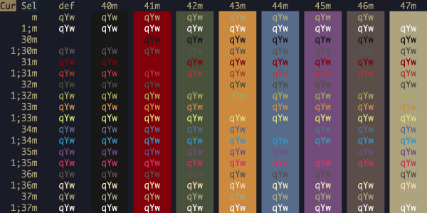

`citruszest`

`Cobalt Neon`

`Cobalt2`

`CobaltNext-Dark`

`CobaltNext-Minimal`

`CobaltNext`

`CrayonPonyFish`

`CutiePro`

`Cyberdyne`

`cyberpunk`

`CyberpunkScarletProtocol`

`Dark Modern`

`Dark Pastel`

`Dark+`

`darkermatrix`

`darkmatrix`

`Darkside`

`deep`

`Desert`

`detuned`

`Dimidium`

`DimmedMonokai`

`Django`

`DjangoRebornAgain`

`DjangoSmooth`

`Doom Peacock`

`DoomOne`

`DotGov`

`Dracula+`

`Dracula`

`duckbones`

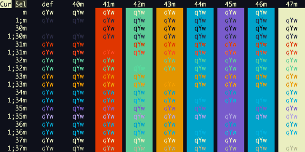

`Duotone Dark`

`Earthsong`

`electron-highlighter`

`Elegant`

`Elemental`

`Elementary`

`Embark`

`embers-dark`

`ENCOM`

`Espresso Libre`

`Espresso`

`Everblush`

`Everforest Dark - Hard`

`Fahrenheit`

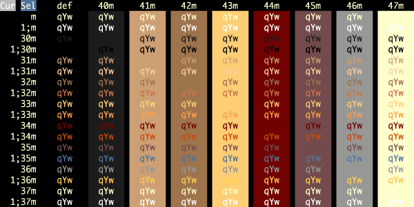

`Fairyfloss`

`farmhouse-dark`

`Fideloper`

`Firefly Traditional`

`FirefoxDev`

`Firewatch`

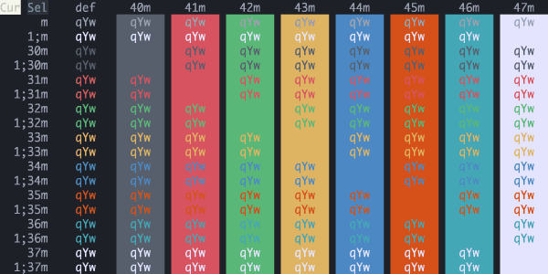

`FishTank`

`Flat`

`Flatland`

`flexoki-dark`

`Floraverse`

`ForestBlue`

`Framer`

`FrontEndDelight`

`FunForrest`

`Galaxy`

`Galizur`

`Ghostty Default StyleDark`

`GitHub Dark`

`GitHub-Dark-Colorblind`

`GitHub-Dark-Default`

`GitHub-Dark-Dimmed`

`GitHub-Dark-High-Contrast`

`GitLab-Dark-Grey`

`GitLab-Dark`

`Glacier`

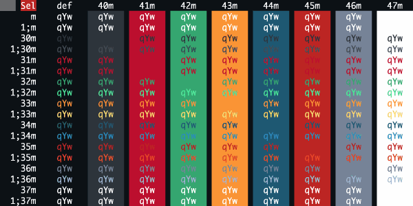

`Grape`

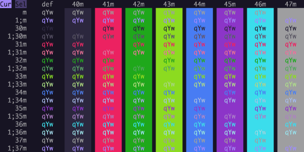

`Grass`

`Grey-green`

`gruber-darker`

`gruvbox-material`

`GruvboxDark`

`GruvboxDarkHard`

`Guezwhoz`

`Hacktober`

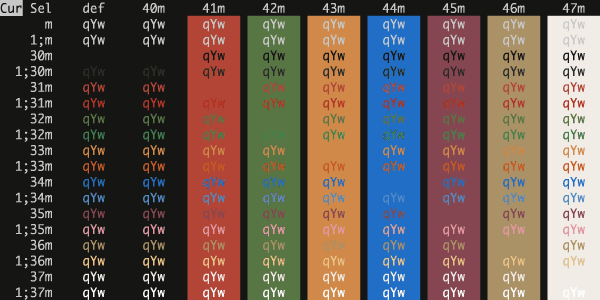

`Hardcore`

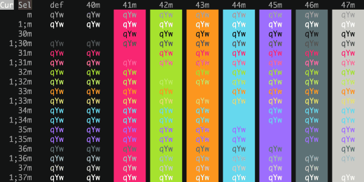

`Harper`

`Havn Skumring`

`HaX0R_BLUE`

`HaX0R_GR33N`

`HaX0R_R3D`

`heeler`

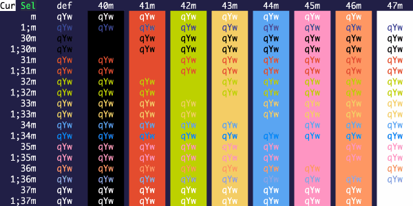

`Highway`

`Hipster Green`

`Hivacruz`

`Homebrew`

`Hopscotch.256`

`Hopscotch`

`Horizon`

`Hurtado`

`Hybrid`

`IC_Green_PPL`

`IC_Orange_PPL`

`iceberg-dark`

`idea`

`idleToes`

`IR_Black`

`IRIX Console`

`IRIX Terminal`

`iTerm2 Dark Background`

`iTerm2 Default`

`iTerm2 Pastel Dark Background`

`iTerm2 Smoooooth`

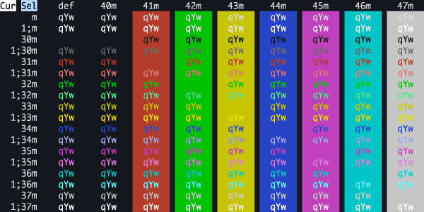

`iTerm2 Solarized Dark`

`iTerm2 Tango Dark`

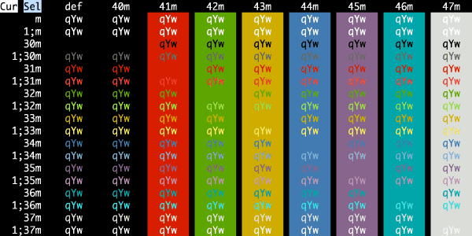

`Jackie Brown`

`Japanesque`

`Jellybeans`

`JetBrains Darcula`

`jubi`

`Kanagawa Dragon`

`Kanagawa Wave`

`kanagawabones`

`Kibble`

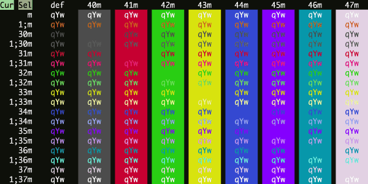

`Kolorit`

`Konsolas`

`kurokula`

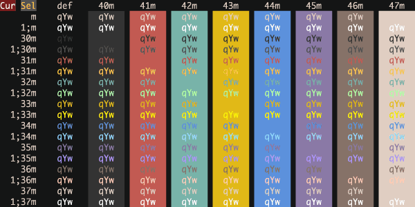

`Lab Fox`

`Laser`

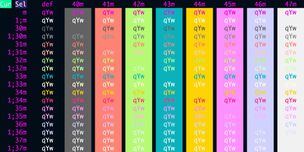

`Later This Evening`

`Lavandula`

`LiquidCarbon`

`LiquidCarbonTransparent`

`LiquidCarbonTransparentInverse`

`lovelace`

`Mariana`

`MaterialDark`

`MaterialDarker`

`MaterialDesignColors`

`MaterialOcean`

`Mathias`

`matrix`

`Medallion`

`Melange_dark`

`Mellifluous`

`mellow`

`miasma`

`midnight-in-mojave`

`Mirage`

`Misterioso`

`Molokai`

`MonaLisa`

`Monokai Classic`

`Monokai Pro Machine`

`Monokai Pro Octagon`

`Monokai Pro Ristretto`

`Monokai Pro Spectrum`

`Monokai Pro`

`Monokai Remastered`

`Monokai Soda`

`Monokai Vivid`

`moonfly`

`N0tch2k`

`neobones_dark`

`Neon`

`Neopolitan`

`Neutron`

`nightfox`

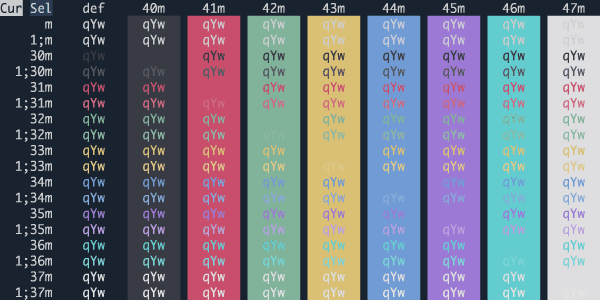

`NightLion v1`

`NightLion v2`

`NightOwl`

`niji`

`Nocturnal Winter`

`nord-wave`

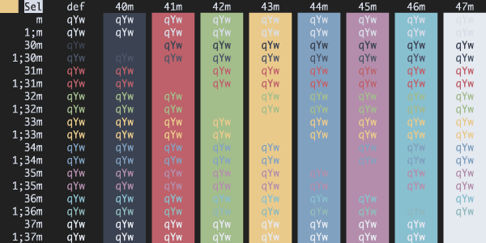

`nord`

`NvimDark`

`Obsidian`

`Ocean`

`Oceanic-Next`

`OceanicMaterial`

`Ollie`

`One Double Dark`

`OneHalfDark`

`Operator Mono Dark`

`Overnight Slumber`

`Oxocarbon`

`PaleNightHC`

`Pandora`

`Paraiso Dark`

`PaulMillr`

`PencilDark`

`Peppermint`

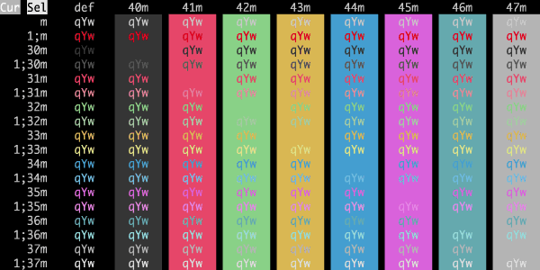

`Pnevma`

`Popping and Locking`

`Pro`

`Purple Rain`

`purplepeter`

`Rapture`

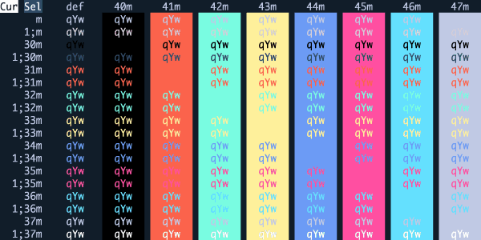

`Raycast_Dark`

`rebecca`

`Red Alert`

`Red Planet`

`Red Sands`

`Relaxed`

`Retro`

`RetroLegends`

`Rippedcasts`

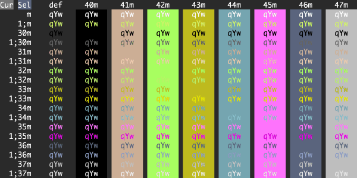

`rose-pine-moon`

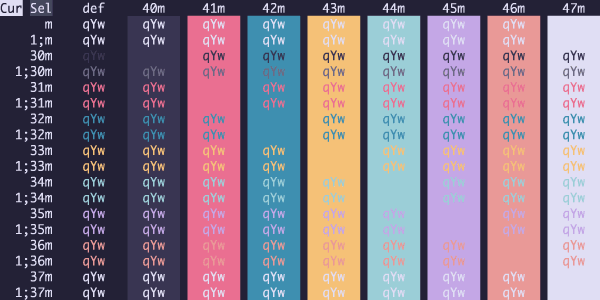

`rose-pine`

`Rouge 2`

`Royal`

`Ryuuko`

`Sakura`

`Scarlet Protocol`

`Seafoam Pastel`

`SeaShells`

`selenized-dark`

`seoulbones_dark`

`Seti`

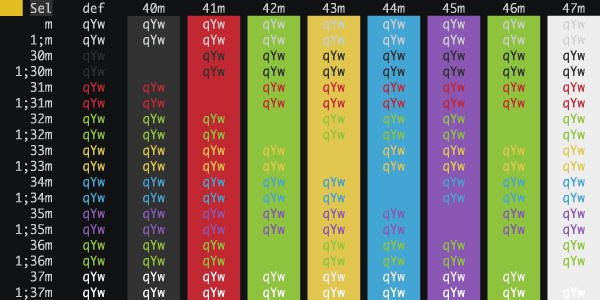

`shades-of-purple`

`Shaman`

`Slate`

`SleepyHollow`

`Smyck`

`Snazzy Soft`

`Snazzy`

`SoftServer`

`Solarized Darcula`

`Solarized Dark - Patched`

`Solarized Dark Higher Contrast`

`solarized-osaka-night`

`sonokai`

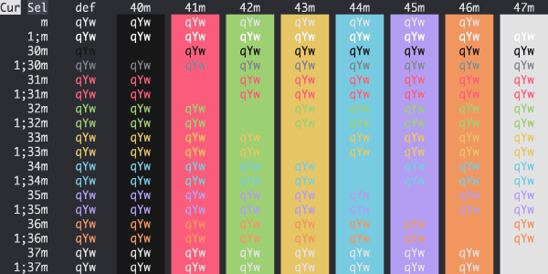

`Spacedust`

`SpaceGray Bright`

`SpaceGray Eighties Dull`

`SpaceGray Eighties`

`SpaceGray`

`Spiderman`

`Square`

`Squirrelsong Dark`

`srcery`

`starlight`

`Sublette`

`Subliminal`

`Sugarplum`

`Sundried`

`Symfonic`

`synthwave-everything`

`synthwave`

`SynthwaveAlpha`

`Teerb`

`terafox`

`Terminal Basic Dark`

`Thayer Bright`

`The Hulk`

`Tinacious Design (Dark)`

`tokyonight-storm`

`tokyonight`

`tokyonight_moon`

`tokyonight_night`

`Tomorrow Night Blue`

`Tomorrow Night Bright`

`Tomorrow Night Burns`

`Tomorrow Night Eighties`

`Tomorrow Night`

`ToyChest`

`Treehouse`

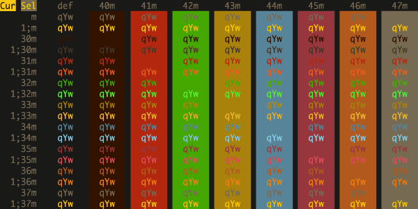

`Twilight`

`Ubuntu`

`UltraDark`

`UltraViolent`

`UnderTheSea`

`Urple`

`Vague`

`Vaughn`

`Vesper`

`VibrantInk`

`Violet Dark`

`WarmNeon`

`Wez`

`Whimsy`

`WildCherry`

`wilmersdorf`

`Wombat`

`Wryan`

`xcodedark`

`xcodedarkhc`

`xcodewwdc`

`zenbones_dark`

`Zenburn`

`zenburned`

`zenwritten_dark`

## Light Themes<a name="lightthemes"><a/>

`3024 Day`

`Adwaita`

`Alabaster`

`Apple System Colors Light`

`AtomOneLight`

`ayu_light`

`Belafonte Day`

`BlulocoLight`

`Breadog`

`catppuccin-latte`

`CLRS`

`coffee_theme`

`dayfox`

`Everforest Light - Med`

`farmhouse-light`

`flexoki-light`

`GitHub-Light-Colorblind`

`GitHub-Light-Default`

`GitHub-Light-High-Contrast`

`Github`

`GitLab-Light`

`GruvboxLight`

`GruvboxLightHard`

`Havn Daggry`

`Horizon-Bright`

`iceberg-light`

`iTerm2 Light Background`

`iTerm2 Solarized Light`

`iTerm2 Tango Light`

`LightOwl`

`Man Page`

`Material`

`Melange_light`

`Monokai Pro Light Sun`

`Monokai Pro Light`

`neobones_light`

`Night Owlish Light`

`nord-light`

`Novel`

`NvimLight`

`One Double Light`

`OneHalfLight`

`PencilLight`

`Piatto Light`

`primary`

`Pro Light`

`Raycast_Light`

`rose-pine-dawn`

`selenized-light`

`seoulbones_light`

`Spring`

`Tango Adapted`

`Tango Half Adapted`

`Terminal Basic`

`Tinacious Design (Light)`

`tokyonight-day`

`Tomorrow`

`Unikitty`

`vimbones`

`Violet Light`

`xcodelight`

`xcodelighthc`

`zenbones`

`zenbones_light`

`zenwritten_light`

